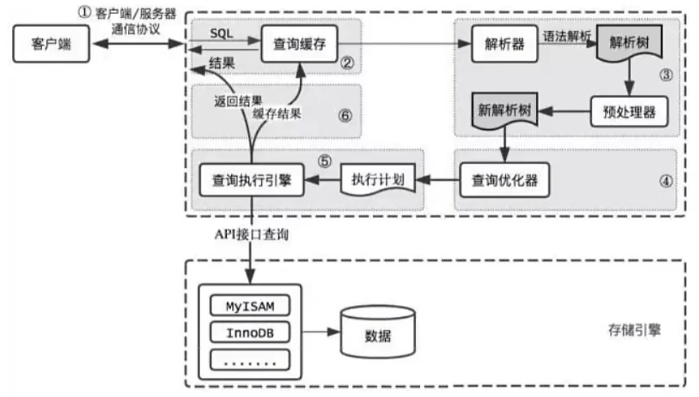
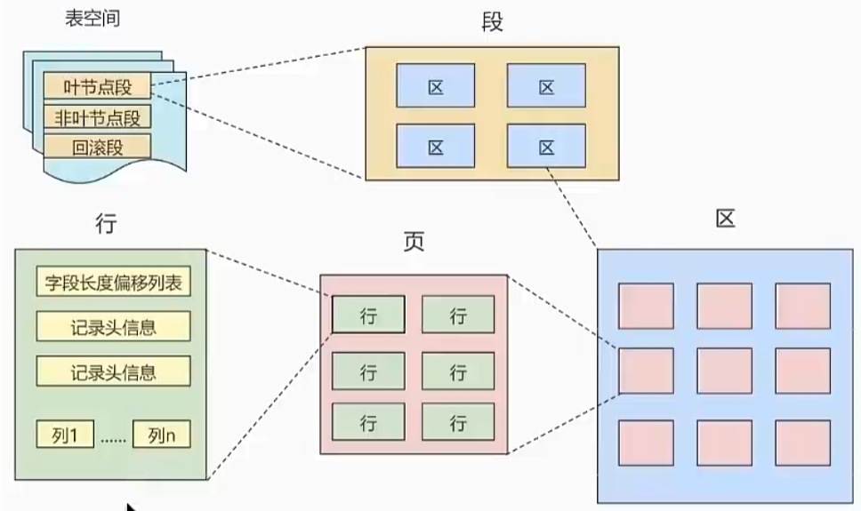
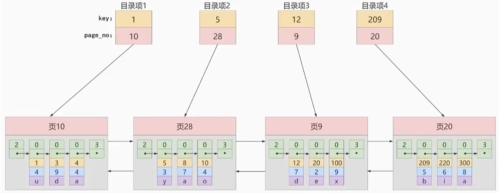

## 逻辑架构

> 参考:[MySQL逻辑架构 - 知乎 (zhihu.com)](https://zhuanlan.zhihu.com/p/416970649)

### 连接层

将MySQL服务层通过线程池和TCP连接池，与多个客户端连接。主要工作是:**连接处理**、**授权认证**、**安全防护**。

### 服务层

服务层用于处理核心服务，如标准的SQL接口、查询解析、SQL优化和统计、全局的和引擎依赖的缓存与缓冲器等等。所有的与存储引擎无关的工作，如过程、函数等，都会在这一层来处理。在该层上，服务器会解析查询并创建相应的内部解析树，并对其完成优化，如确定查询表的顺序，是否利用索引等，最后生成相关的执行操作。

服务层可以细分为几个部分:

- **SQL Interface: SQL接口**

  - 接收用户的SQL命令，并且返回用户需要查询的结果。比如SELECT ... FROM就是调用SQL Interface 
  - MySQL支持DML（数据操作语言）、DDL（数据定义语言）、存储过程、视图、触发器、自定义函数等多种SQL语言接口

- **Parser:** **解析器**

  - 在解析器中对 SQL 语句进行语法分析、语义分析。将SQL语句分解成数据结构，并将这个结构传递到后续步骤，以后SQL语句的传递和处理就是基于这个结构的。如果在分解构成中遇到错误，那么就说明这个SQL语句是不合理的。
  - 在SQL命令传递到解析器的时候会被解析器验证和解析，并为其创建语法树，并根据数据字典丰富查询语法树，会验证该客户端是否具有执行该查询的权限。创建好语法树后，MySQL还会对SQL查询进行语法上的优化，进行查询重写。

- **Optimizer:** **查询优化器**

  - SQL语句在语法解析之后、查询之前会使用查询优化器确定 SQL 语句的执行路径，生成一个执行计划。
  - 这个执行计划表明应该使用哪些索引进行查询（全表检索还是使用索引检索），表之间的连接顺序如何，最后会按照执行计划中的步骤调用存储引擎提供的方法来真正的执行查询，并将查询结果返回给用户。
  - 它使用“**选取-投影-连接**”策略进行查询。例如:

  ```mysql
  SELECT id,name FROM student WHERE gender = '女';
  ```

  这个SELECT查询先根据WHERE语句进行选取，而不是将表全部查询出来以后再进行gender过滤。 这个SELECT查询先根据id和name进行属性投影，而不是将属性全部取出以后再进行过滤，将这两个查询条件连接起来生成最终查询结果。

- **Caches & Buffers: 查询缓存组件**

  - MySQL内部维持着一些Cache和Buffer，比如Query Cache用来缓存一条SELECT语句的执行结果，如果能够在其中找到对应的查询结果，那么就不必再进行查询解析、优化和执行的整个过程了，直接将结果反馈给客户端。
  - 这个缓存机制是由一系列小缓存组成的。比如表缓存，记录缓存，key缓存，权限缓存等 。
  - 这个查询缓存可以在不同客户端之间共享。 
  - 从MySQL5.7.20开始，不推荐使用查询缓存，**并在MySQL 8.0中删除**。

### 引擎层

存储引擎层，存储引擎负责实际的MySQL数据的**存储与提取，服务器通过API 与 存储引擎进行通信**。不同的存储引擎功能和特性有所不同，这样可以根据实际需要有针对性的使用不同的存储引擎。

### SQL执行流程



**MySQL的查询流程:**

**1.** **查询缓存**:Server如果在查询缓存中发现了这条SQL语句，就会直接将结果返回给客户端；如果没有，就进入到解析器阶段。需要说明的是，因为查询缓存往往效率不高，所以在MySQL8.0之后就抛弃了这个功能。

查询缓存是提前把查询结果缓存起来，这样下次不需要执行就可以直接拿到结果。需要说明的是，在MySQL中的查询缓存，不是缓存查询计划，而是查询对应的结果。只有**相同的查询操作才会命中查询缓存**。**两个查询请求在任何字符上的不同（例如:空格、注释、大小写），都会导致缓存不会命中**。

同时，如果查询请求中包含某些系统函数、用户自定义变量和函数、一些系统表，如 mysql、 information_schema、 performance_schema 数据库中的表，那这个请求就不会被缓存。

此外，既然是缓存，那就有它缓存失效的时候。MySQL的缓存系统会监测涉及到的每张表，只要该表的结构或者数据被修改，如对该表使用了`INSERT`、`UPDATE`、`DELETE`、`TRUNCATE TABLE`、`ALTER TABLE`、`DROP TABLE`或`DROP DATABASE`语句，那使用该表的所有缓存都将变为无效并被删除。对于更新压力大的数据库来说，查询缓存的命中率会非常低。

**2.** **解析器**:在解析器中对SQL语句进行语法分析、语义分析。

分析器先做**词法分析**。用户输入的是由多个字符串和空格组成的一条SQL语句，MySQL需要识别出里面的字符串分别是什么，代表什么。 

接着做**语法分析**。根据词法分析的结果，语法分析器（比如:Bison）会根据语法规则，判断用户输入的这个SQL语句是否满足MySQL语法。如果SQL语句正确，则会生成一个语法树，否则，报语法错误的信息

**3.** **优化器**:在优化器中会确定SQL语句的执行路径，比如是根据全表检索，还是根据索引检索等。在查询优化器中，可以分为逻辑查询优化阶段和物理查询优化阶段。

物理优化:通过索引、表连接方式等技术进行优化；逻辑优化:通过SQL等价变换提升查询效率。

**4.** **执行器**:在执行之前需要判断该用户是否具备权限。如果没有，就会返回权限错误。如果具备权限，就执行 SQL查询并返回结果。在 MySQL8.0 以下的版本，如果设置了查询缓存，这时会将查询结果进行缓存。

## 存储引擎

MySQL中的数据用各种不同的技术存储在文件(或者内存)中。这些技术中的每一种技术都使用不同的存储机制、索引技巧、锁定水平并且最终提供广泛的不同的功能和能力。通过选择不同的技术，你能够获得额外的速度或者功能，从而改善你的应用的整体功能。

而存储引擎说白了就是**如何存储数据**、**如何为存储的数据建立索引**、**如何更新/查询数据**等技术的实现方法。

MySQL 提供了多个存储引擎，在 MySQL 中，不需要在整个服务器中使用同一种存储引擎，针对具体的要求，可以对每一个表使用不同的存储引擎。

### 常见存储引擎

- ##### **InnoDB:主要的事务存储引擎**

  - InnoDB，支持事务、行级锁、自增主键、外键、自动灾难恢复。
  - MySQL5.5之后，成为默认存储引擎。 

  - **除非有非常特别的原因需要使用其他的存储引擎，否则应该优先考虑InnoDB引擎。**

  - 数据文件结构:
    - 表名.frm 存储表结构（MySQL8.0时，合并在表名.ibd中）
    - 表名.ibd 存储数据和索引

  - 对比MyISAM的存储引擎，InnoDB写的处理效率差一些，并且会占用更多的磁盘空间以保存数据和索引。


- ##### **MyISAM:主要的非事务存储引擎**

  - MyISAM提供了大量的特性，包括全文索引、压缩、空间函数(GIS)等，但MyISAM不支持事务、行级锁、外键。

  - 5.5之前默认的存储引擎

  - 优势是**访问的速度快**，适合对事务完整性没有要求或者以SELECT、INSERT为主的应用

  - 针对数据统计有额外的常数存储。故而 count(*) 的查询效率很高

  - 数据文件结构:
    - 表名.frm 存储表结构
    - 表名.MYD 存储数据 (MYData)
    - 表名.MYI 存储索引 (MYIndex)

  - 应用场景:只读应用或者以读为主的业务


**InnoDB和MyISAM对比**

| 对比项         | **MyISAM**                                               | **InnoDB**                                                   |
| -------------- | -------------------------------------------------------- | ------------------------------------------------------------ |
| 外键           | 不支持                                                   | 支持                                                         |
| 事务           | 不支持                                                   | 支持                                                         |
| 行表锁         | 表锁，即使操作一条记录也会锁住整个表，不适合高并发的操作 | 行锁，操作时只锁某一行，不对其它行有影响，适合高并发的操作   |
| 缓存           | 只缓存索引，不缓存真实数据                               | 不仅缓存索引还要缓存真实数据，对内存要求较高，而且内存大小对性能有决定性的影响 |
| 自带系统表使用 | 是                                                       | 是                                                           |
| 关注点         | 性能:节省资源、消耗少、简单业务                          | 事务:并发写、事务、更大资源                                  |
| 默认安装       | 是                                                       | 是                                                           |
| 默认使用       | 否                                                       | 是                                                           |

### InnoDB详解

> 参考:[mysql存储引擎InnoDB详解，从底层看清InnoDB数据结构 - 知乎 (zhihu.com)](https://zhuanlan.zhihu.com/p/180531140)

#### 数据库存储结构

数据是存放在磁盘上的，会先读取到内存中再由CPU进行操作。由于磁盘读取速度很慢，如果每次操作都只读取一行数据的话，磁盘IO量会非常高，导致性能很差。因此InnoDB将磁盘中的所有数据划分为若干个**页（page）**，以页作为磁盘与内存交互的基本单位，一般页的大小为**16KB**。**页与页之间通过双向链表进行连接**。

这主要是基于两种维度进行考量:

1. 时间维度:如果一条数据正在在被使用，那么在接下来一段时间内大概率还会再被使用。可以认为热点数据缓存都属于这种思路的实现。
2. 空间维度:如果一条数据正在在被使用，那么存储在它附近的数据大概率也会很快被使用。InnoDB的数据页和操作系统的页缓存则是这种思路的体现。

**页的上层结构**

除了页之外，在数据库中还存在着区（Extent）、段（Segment）和表空间（Tablespace）的概念。



- 区（Extent）:是比页大一级的存储结构，一个区有**64个连续的页**，所以一个区的大小为**1MB**。
- 段（Segment）:由一个或多个区（不要求相邻）组成。**段是数据库中的分配单位**。
- 表空间（Tablespace）:由一个或多个段组成

InnoDB 中的页并非只有一种，比如有存放 Insert Buffer 的页、存放 undo log 的页、存放数据的页等等。其中我们最关注的还是存放我们表数据的页，又称**索引页**，或者**数据页**，以下介绍的就是**数据页**。

**页的内部结构**

一个页由七部分构成:

| 名称                                 | 占用空间 | 描述                                                         |
| ------------------------------------ | -------- | ------------------------------------------------------------ |
| File Header（文件头）                | 38字节   | 页的通用信息（比如页的编号、其上一页、下一页是谁等）         |
| Page Header（页头部）                | 56字节   | 页的专有信息（比如存储了多少条数据、第一条数据的地址等）     |
| Infimum + Supremum（最小和最大记录） | 26字节   | 指向页中的最小记录和最大记录的指针（比较的是主键大小）       |
| User Records（用户记录）             | 不确定   | 存储的数据（单向链表方式存储）                               |
| Free Space（空闲空间）               | 不确定   | 页中尚未使用的空间                                           |
| Page Directory（页目录）             | 不确定   | 为页中存储的数据记录目录，方便通过二分法查找某条具体数据的位置 |
| File Trailer（文件尾）               | 8字节    | 校验页的完整性                                               |

#### 行格式

行格式就是页中真正保存的数据的格式。行格式分为四种:`Compact`、`Redundant`、`Dynamic`、`Compressed`。行格式之间都大同小异，主要介绍`Compact`。

> 几种行格式的具体区别可以参考:[Innodb 四种行格式对比_shuifa2008的博客-CSDN博客](https://blog.csdn.net/shuifa2008/article/details/103759062)


##### 变长字段长度列表

MySQL支持一些变长的数据类型，比如VARCHAR(M)、VARBINARY(M)、TEXT类型，BLOB类型，拥有这些数据类型的列称为**变长字段**，变长字段中存储多少字节的数据不是固定的，所以我们在存储真实数据的时候需要**把这些数据实际上占用的字节数也存起来**。在Compact行格式中，把所有变长字段的真实数据占用的字节长度都存放在记录的开头部位，从而形成一个变长字段长度列表。

>  注意:这里面存储的变长长度和字段顺序是反过来的。比如两个varchar字段在表结构的顺序是a(10)，b(15)。那么在变长字段长度列表中存储的长度顺序就是15，10。

##### NULL值列表

Compact行格式会**把可以为NULL的列存在一个NULL值列表中**。如果表中没有允许存储NULL的列，则NULL值列表也不存在。

例如一个表中有四个列C1、C2、C3、C4，其中C2、C3允许为NULL，则NULL值列表中会有两个bit位来**逆序**表示每条C2、C3是否为NULL。

规则为:bit位的值为1时，代表该列的值为NULL；bit位的值为0时，代表该列的值不为NULL。

例如一条行记录为`1,NULL,NULL,a`，则它的NULL值列表就为`1 1`；

例如一条行记录为`2,b,NULL,a`，则它的NULL值列表就为`1 0`；

之所以要存储NULL值列表是因为数据都是需要对齐的，如果没有标注出来NULL值的位置，就有可能在查询数据的时候出现混乱。如果使用一个特定的符号放到相应的数据位表示空置的话，虽然能达到效果，但是这样很浪费空间，所以直接就在行数据得头部开辟出一块空间专门用来记录该行数据哪些是非空数据，哪些是空数据。

##### 记录头信息

记录头信息分为几个部分:


| 名称            | 大小（单位:bit） | 描述                                                         |
| --------------- | ---------------- | ------------------------------------------------------------ |
| `预留位1`       | 1                | 没有使用                                                     |
| `预留位2`       | 1                | 没有使用                                                     |
| `delete_mask`   | 1                | 标记该记录是否被删除（1表示被删除，0表示未删除）             |
| `mini_rec_mask` | 1                | B+树的每层非叶子节点中的（主键）最小记录都会添加该标记（值为1） |
| `n_owned`       | 4                | 页目录中每个组中最后一条记录的头信息中会存储该组有多少条记录，就是n_owned |
| `heap_no`       | 13               | 表示当前记录在这个页的中的位置                               |
| `record_type`   | 3                | 表示当前记录的类型，`0`表示普通记录，`1`表示B+树非叶子节点记录，`2`表示最小记录，`3`表示最大记录 |
| `next_record`   | 16               | 表示下一条记录的相对位置                                     |

##### 隐藏列

记录的真实数据中，除了自定义的列的数据以外，还有三个隐藏列:

| 列名                        | 是否必须 | 占用空间 | 描述                   |
| --------------------------- | -------- | -------- | ---------------------- |
| DB_ROW_ID（row_id）         | 否       | 6字节    | 行ID，唯一标识一条记录 |
| （DB_TRX_ID）transaction_id | 是       | 6字节    | 事务ID                 |
| （DB_ROLL_PTR）roll_pointer | 是       | 7字节    | 回滚指针               |

一个表没有手动定义主键，则会选取一个Unique键作为主键，如果连Unique键都没有定义的话，则会为表默认添加一个名为row_id的隐藏列作为主键。所以row_id是在没有自定义主键以及Unique键的情况下才会存在的。

##### 行溢出

一个页的大小一般为16KB，但是MySQL中有些不定长的字段可以存储的值很大，例如VARCHAR最多可以存储65533个字节，这样的话就会导致一个页面连一条记录都存不下，这种现象就是行溢出。

在Compact和Reduntant行格式中，对于占用存储空间非常大的列，在记录的真实数据处只会**存储该列的一部分数据**，把剩余的数据分散存储在几个其他的页中进行**分页存储**，然后记录的真实数据处用20个字节存储指向这些页的地址（当然这20个字节中还包括这些分散在其他页面中的数据的占用的字节数），从而可以找到剩余数据所在的页。这称为**页的扩展**。

在MySQL8.0中，默认行格式就是Dynamic。Dynamic、Compressed行格式和Compact行格式基本一致，只不过在处理行溢出数据时不同:

- Compressed和Dynamic两种记录格式对于存放在BLOB中的数据采用了完全的行溢出的方式。在数据页中只存放20个字节的指针（溢出页的地址），实际的数据都存放在Off Page（溢出页）中。
- Compact和Redundant两种格式会在记录的真实数据处存储一部分数据（存放768个前缀字节）。

#### 区、段和碎片区（了解）

##### 为什么要有区

B+树的每一层中的页都会形成一个双向链表，如果是以页为单位来分配存储空间的话，双向链表相邻的两个页之间的物理位置可能离得非常远。B+树索引的使用场景中，范围查询只需要定位到最左边的记录和最右边的记录，然后沿着双向链表一直扫描就可以了。而如果链表中相邻的两个页物理位置离得非常远，就会发生随机I/O。随机I/O是非常慢的，所以我们应该尽量让链表中相邻的页的物理位置也相邻，这样进行范围查询的时候才可以使用顺序I/O。

所以引入区的概念，一个区就是物理位置上连续的64个页。在表中数据量大的时候，为某个索引分配空间的时候就不再按照页的单位分配了，而是按照区为单位分配，甚至在表中的数据特别多的时候，可以一次性分配多个连续的区。虽然可能造成一点点空间的浪费（数据不足以填充满整个区），但是从性能角度看，可以消除很多的随机I/O。

##### 为什么要有段

对于范围查询，其实是对B+树叶子节点中的记录进行顺序扫描，而如果不区分叶子节点和非叶子节点，统统把节点代表的页面放到申请到的区中的话，进行范围扫描的效果就大打折扣了。所以InnoDB对B+树的叶子节点和非叶子节点进行了区别对待，也就是说叶子节点有自己独有的区，非叶子节点也有自己独有的区。存放叶子节点的区的集合就算是一个段（segment），存放非叶子节点的区的集合也算是一个段。也就是说一个索引会生成2个段，一个叶子节点段，一个非叶子节点段。

除了索引的叶子节点段和非叶子节点段之外，InnoDB中还有为存储一些特殊的数据而定义的段，比如回滚段。所以，常见的段有数据段、索引段、回滚段。数据段即为B+树的叶子节点，索引段即为B+树的非叶子节点。

在InnoDB存储引擎中，对段的管理都是由引擎自身所完成，DBA不能也没有必要对其进行控制。这从一定程度上简化了DBA对于段的管理。

段其实不对应表空间中的某一个连续的物理区域，而是一个逻辑上的概念，由若干个零散的页面以及一些完整的区组成。

##### 为什么要有碎片区

默认情况下，一个使用InnoDB存储引擎的表只有一个聚簇索引，一个索引会生成2个段，而段是以区为单位申请存储空间的，一个区默认占用1M（64*16KB=1024KB）存储空间，所以默认情况下一个只存在几条记录的小表也需要2M的存储空间么？以后每次添加一个索引都要多申请2M的存储空间么？这对于存储记录比较少的表简直是天大的浪费。这个问题的症结在于到现在为止我们介绍的区都是非常纯粹的，也就是一个区被整个分配给某一个段，或者说区中的所有页面都是为了存储同一个段的数据而存在的，即使段的数据填不满区中所有的页面，那余下的页面也不能挪作他用。

为了考虑以完整的区为单位分配给某个段对于数据量较小的表太浪费存储空间的这种情况，InnoDB提出了一个碎片（fragment）区的概念。在一个碎片区中，并不是所有的页都是为了存储同一个段的数据而存在的，而是碎片区中的页可以用于不同的目的，比如有些页面用于段A，有些页面用于段B，有些页甚至哪个段都不属于。碎片区直属于表空间，并不属于任何一个段。

所以此后为某个段分配存储空间的策略是这样的:

- 在刚开始向表中插入数据的时候，段是从某个碎片区以单个页面为单位来分配存储空间的。
- 当某个段已经占用了32个碎片区页面之后，就会申请以完整的区为单位来分配存储空间。

所以现在段不能仅定义为是某些区的集合，更精确的应该是某些零散的页面以及一些完整的区的集合。

##### 区的分类

区大体上可以分为4种类型:

- 空闲的区(FREE):现在还没有用到这个区中的任何页面。
- 有剩余空间的碎片区(FREE_FRAG):表示碎片区中还有可用的页面。
- 没有剩余空间的碎片区(FULL_FRAG):表示碎片区中的所有页面都被使用，没有空闲页面。
- 附属于某个段的区(FSEG):每一索引都可以分为叶子节点段和非叶子节点段

处于`FREE`、`FREE_FRAG`以及`FULL_FRAG`这三种状态的区都是独立的，直属于表空间。而处于`FSEG`状态的区是附属于某个段的。

## 索引的数据结构

### 什么是索引

MySQL官方对索引的定义为:**索引**（Index）是帮助MySQL高效获取数据的**数据结构**。在InnoDB中，索引的形式为B+树。

这里所谓的高效，是指当我们从磁盘中读取数据时，应该尽可能地**减少磁盘IO次数**。

之前我们讲过InnoDB中，磁盘与内存交互的基本单位是页。可以想象一下，如果我们需要从MySQL中查找一条数据，应该如何查找？

朴素的思想:将数据页（或者区）读取到内存，然后再在内存中通过页目录，查询所需要的数据；如果未查询到，又需要进行一次磁盘IO，读取新的数据页到内存中。试想一下，如果一个表中有百万、千万条数据，即使我们每次进行磁盘IO的时候都尽量读取很多的数据页到内存中进行查询，但是产生的磁盘IO次数也还是会非常多。

这时就需要一种**数据结构**来**快速找到数据存在的那个数据页**，从而**减少磁盘IO次数**。这个数据结构就是**B+树**。

> 如果还未了解B+树，可以参考:[什么是B+树？（详细图解）_初念初恋的博客-CSDN博客_b+树](https://blog.csdn.net/jiang_wang01/article/details/113739230)

### 索引的设计方案

现在，假设现在一张表中有这么几条数据（为了演示方便，假设一个页中最多只有三条数据、每次磁盘IO只能读取一个页）。

此时，假设我们需要查询**主键（黄色字段）=20**的行数据，就会遇到刚才说的问题:需要先读取页10，再读取页28，再读取页9，最终找到数据，可以想象一下如果数据量很大，必然会产生很多次磁盘IO。


解决方案就是我们设计一个目录项:



目录项中有两个字段:

- page_no:这个目录项所表示的数据页的编号
- key:这个目录项所表示的数据页的中最小的数据的**主键值**

有了目录项，就可以先把目录项都读取到内存中，通过二分法查找，根据目录项中key的范围找到目标数据在哪个数据页中，然后直接读取那个数据页即可。

但是，随着数据量的增大，数据页会越来越多，相应的，**目录项也会越来越多**，直到需要多次磁盘IO才能把目录项全部读入内存中，这样又退化到我们设计目录项之前的状态了。同时，目录项还缺乏一个具体的存储结构来管理。

于是，我们可以**将目录项用数据页来存储**。并且，给存放目录项的数据页再设计一个数据页用来存放其目录项，简称套娃。


**目录项记录** 和普通的 **用户记录** 的 **不同点**:

* **目录项记录** 的 record_type 值是1，而 **普通用户记录** 的 record_type 值是0，InnoDB就是通过这个来区分 **用户记录** 和 **目录项记录** 的。
* 目录项记录只有 **主键值和页的编号** 两个列，而普通的用户记录的列是用户自己定义的，可能包含 **很多列** ，另外还有InnoDB自己添加的隐藏列。 
* 了解:记录头信息里还有一个叫 **min_rec_mask** 的属性，只有在存储 **目录项记录** 的页中的主键值最小的 **目录项记录** 的 **min_rec_mask** 值为 **1** ，其他别的记录的 **min_rec_mask** 值都是 **0** 。

**相同点**:两者用的是一样的数据页，都会为主键值生成 **Page Directory （页目录）**，从而在按照主键值进行查找时可以使用 **二分法** 来加快查询速度。

像这样的数据结构，就是B+树:


一个B+树的节点其实可以分成好多层，规定最下边的那层，也就是存放我们用户记录的那层为第0层，之后依次往上加。之前我们做了一个非常极端的假设:存放用户记录的页最多存放3条记录，存放目录项记录的页最多存放4条记录。其实真实环境中一个页存放的记录数量是非常大的，假设所有存放用户记录 的叶子节点代表的数据页可以存放 100条用户记录 ，所有存放目录项记录的内节点代表的数据页可以存 放 1000条目录项记录，那么:

* 如果B+树只有1层，也就是只有1个用于存放用户记录的节点，最多能存放 100 条记录。
* 如果B+树有2层，最多能存放 1000×100=10,0000 条记录。 
* 如果B+树有3层，最多能存放 1000×1000×100=1,0000,0000 条记录。 
* 如果B+树有4层，最多能存放 1000×1000×1000×100=1000,0000,0000 条记录。

而每多一层B+树只会增加一次磁盘IO。一般来说，三层B+树索引足以存放百万级别的数据，而它的磁盘IO次数只有三次。

### 索引的分类

#### 聚簇索引

上面的例子中，我们是根据数据的**主键**来对数据进行排序的，这种索引就称为**主键索引/聚簇索引/一级索引**。这种索引只能针对查询条件是主键的查询进行索引优化。

**特点:**

* 使用记录主键值的大小进行记录和页的排序，这包括三个方面的含义: 

  * 页内的记录是按照主键的大小顺序排成一个单向链表。
  * 各个存放用户记录的页也是根据页中用户记录的主键大小顺序排成一个双向链表。 
  * 存放目录项记录的页分为不同的层次，在同一层次中的页也是根据页中目录项记录的主键大小顺序排成一个双向链表。 

* **B+树的叶子节点存储的是完整的用户记录。**

  所谓完整的用户记录，就是指这个记录中存储了所有列的值（包括隐藏列）。

我们把具有这两种特性的B+树称为聚簇索引，所有完整的用户记录都存放在这个聚簇索引的叶子节点处。这种聚簇索引并不需要我们在MySQL语句中显式的使用INDEX语句去创建，InnDB存储引擎会自动的为我们创建聚簇索引。

**优点:**

* **数据访问更快**，因为聚簇索引将索引和数据保存在同一个B+树中，因此从聚簇索引中获取数据比非聚簇索引更快。
* 聚簇索引对于主键的**排序查找**和**范围查找**速度**非常快**。
* 按照聚簇索引排列顺序，查询显示一定范围数据的时候，由于数据都是紧密相连，数据库不用从多个数据块中提取数据，所以节省了大量的io操作。

**缺点:**

* 插入速度严重依赖于插入顺序，按照主键的顺序插入是最快的方式，否则将会出现页分裂，严重影响性能。因此，对于InnoDB表，我们一般都会定义一个自增的ID列为主键。
* 更新主键的代价很高，因为将会导致被更新的行移动。因此，对于InnoDB表，我们一般定义**主键为不可更新**。

#### 非聚簇索引

在实际的使用场景中，很显然不可能总是用主键作为查询条件。这时就需要对不同的**查询字段**按需建立索引了。这种索引就称为**非聚簇索引/二级索引/辅助索引**。


非聚簇索引和聚簇索引最大的区别就在于，它的叶子节点并不存放完整的数据，而是只存放**建立索引的字段**和**主键值**。因此当我们通过非聚簇索引查找数据时，找到的其实只是主键值，此时需要拿主键值，再去聚簇索引中找到完整的数据。这就称为**回表查询**。
