## 事务

### 概述

**事务:**一组逻辑操作单元，使数据从一种状态变换到另一种状态

**事务处理的原则:**保证所有事务都作为一个工作单元来执行，即使出现了故障，都不能改变这种执行方式。当在一个事务中执行多个操作时，要么所有的事务都被提交(**commit**)，那么这些修改就永久地保存下来；要么数据库管理系统将放弃所作的所有修改，整个事务回滚(**rollback**)到最初状态。

**事务的ACID特性:**

一般来说，事务都需要满足以下特性:

- 原子性（atomicity）:

  事务是不可分割的工作单元，要么全部提交，要么全部回滚

- 一致性（consistency）:

  事务执行前后，从一个合法状态变换为另一个合法状态，即执行前后都满足业务的约束（符合业务的要求）

- 隔离性（isolation）:

  多个用户并发访问数据库，执行事务时，事务之间不会互相干扰

- 持久性（durability）

  事务一旦被提交，数据的改变就是永久性的


**事务的状态:**

- **活动的（active）**

  事务对应的数据库操作正在执行过程中时，我们就说该事务处在**活动的**状态。

- **部分提交的（partially committed）**

  当事务中的最后一个操作执行完成，但由于操作都在内存中执行，所造成的影响并**没有刷新到磁盘**时，我们就说该事务处在**部分提交的**状态。

- **失败的（failed）**

  当事务处在**活动的**或者**部分提交**的状态时，可能遇到了某些错误（数据库自身的错误、操作系统错误或者直接断电等）而无法继续执行，或者人为的停止当前事务的执行，我们就说该事务处在**失败**的状态。

- **中止的（aborted）**

  如果事务执行了一部分而变为**失败**的状态，那么就需要把已经修改的事务中的操作还原到事务执行前的状态。换句话说，就是要撤销失败事务对当前数据库造成的影响。我们把这个撤销的过程称之为**回滚**。当**回滚**操作执行完毕时，也就是数据库恢复到了执行事务之前的状态，我们就说该事务处在了**中止**的状态。

- **提交的（committed）**

  当一个处在**部分提交**的状态的事务将修改过的数据都**同步到磁盘**上之后，我们就可以说该事务处在了**提交**的状态。

### 使用事务

##### **显式事务**

**步骤1:** `START TRANSACTION` 或者 `BEGIN` ，作用是显式开启一个事务。

```mysql
mysql> BEGIN; 
#或者 
mysql> START TRANSACTION;
```

`START TRANSACTION` 语句相较于 `BEGIN` 特别之处在于，后边能跟随几个**修饰符**: 

①`READ ONLY`:标识当前事务是一个**只读事务**，也就是属于该事务的数据库操作只能读取数据，而不能修改数据。

②`READ WRITE`:标识当前事务是一个**读写事务**，也就是属于该事务的数据库操作既可以读取数据，也可以修改数据。

③`WITH CONSISTENT SNAPSHOT`:启动一致性读。

**步骤2:**一系列事务中的操作（主要是DML，不含DDL）

**步骤3:**提交事务 或 中止事务（即回滚事务）

```mysql
# 提交事务。当提交事务后，对数据库的修改是永久性的。
mysql> COMMIT;
```

```mysql
# 回滚事务。即撤销正在进行的所有没有提交的修改 
mysql> ROLLBACK; 

# 将事务回滚到某个保存点。 
mysql> ROLLBACK TO [SAVEPOINT]
```

其中关于SAVEPOINT相关操作有:

```mysql
# 在事务中创建保存点，方便后续针对保存点进行回滚。一个事务中可以存在多个保存点。
SAVEPOINT 保存点名称;
```

```mysql
# 删除某个保存点
RELEASE SAVEPOINT 保存点名称;
```

##### **隐式事务**

在MySQL中，如果没有显示地用 `START TRANSACTION` 或者 `BEGIN` 开启事务，那么每一条DML语句都会被包装成一个**独立的事务**并自动提交。

有一个系统变量 `autocommit` ，默认为 true ，可以将其修改为 false 来关闭自动提交效果。这样的话写入的多条DML语句都会属于**同一个事务**，直到手动提交或回滚。

##### **隐式提交数据的情况**

- 当使用DDL语句、修改MySQL的表结构时，就会隐式地提交之前未提交的事务
- **事务控制或关于锁定的语句**
  -  当我们在一个事务还没提交或者回滚时就又使用 `START TRANSACTION` 或者 `BEGIN` 语句开启了另一个事务时，会隐式的提交上一个事务。
  -  `autocommit` 为 true
  -  使用`LOCK TABLES`、`UNLOCK TABLES`等关于锁定的语句也会**隐式的提交**前边语句所属的事务。

### 事务隔离级别

#### 数据并发问题

对于 SQL 来说，服务端可能和多个客户端建立连接，每个客户端与服务端建立的连接被称为**会话**（**Session**）。每个会话都可以在自己的会话中向服务器发送请求语句，请求语句可能是事务的一部分，当多个会话同时发送请求时，就会遇到数据并发问题。

1. **脏写（Dirty Write）**

对于了两个事务 `Session A`、`Session B`，如果 `Session A` **修改**了 `Session B` 还未提交的数据，就发生了**脏写**。若 `Session B` 回滚，那么 `Session A` 修改的数据就不存在了。

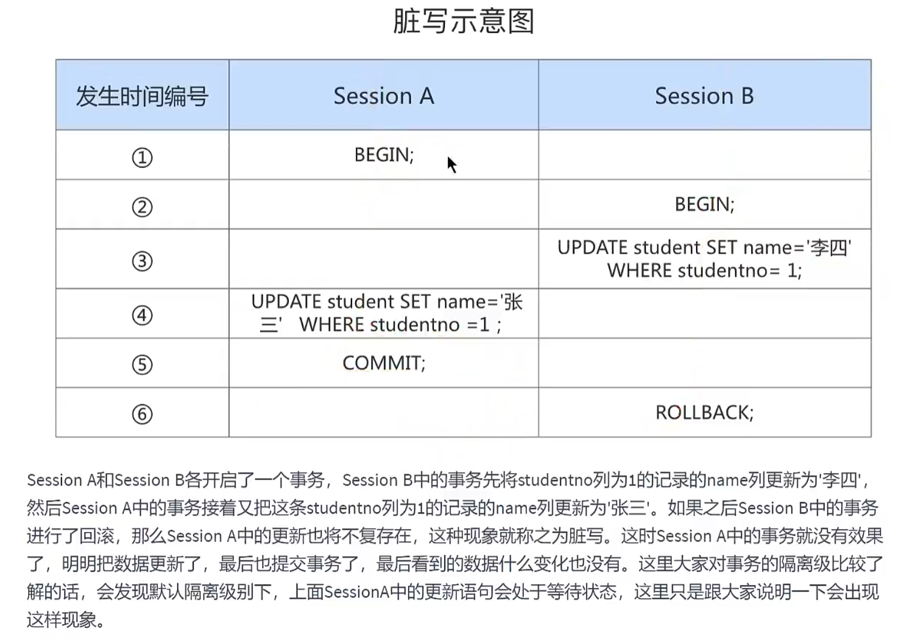

2. **脏读（Dirty Read）**

对于两个事务 `Session A`、`Session B`，如果 `Session A` **读取**了 `Session B` 还未提交的数据，就发生了**脏读**。若 `Session B` 回滚，那么 `Session A` 读取的数据就是临时且失效的。


3. **不可重复读（Non-Repeatable Read）**

对于两个事务 `Session A`、`Session B`，如果 `Session A` **读取**了一个字段，然后 `Session B` 更新了这个字段，之后 `Session A` 再次读取同一个字段，值就不同了，就发生了**不可重复读**（`Session A` 的两次读取是在同一个事务中，因此逻辑上来说应当相同）


4. **幻读（Phantom）**

对于两个事务 `Session A`、`Session B`，如果 `Session A` **读取**了一个字段，然后 `Session B` 在表中插入了一些新的数据，之后 `Session A` 再次读取同一个字段，就会多出一些数据，就发生了**幻读**（如果 `Session B` 删除了一些数据，导致第二次读取到的数据少了，不属于幻读。幻读强调的是读取到了之前没有的记录）


严重程度排序:`脏写 > 脏读 > 不可重复读 > 幻读`

#### SQL的四种隔离级别

SQL标准中设立了4个隔离级别:

- `READ UNCOMMITTED`:读未提交，在该隔离级别，所有事务都可以看到其他未提交事务的执行结果。不能避免脏读、不可重复读、幻读。
- `READ COMMITTED`:读已提交，它满足了隔离的简单定义:一个事务只能看见已经提交事务所做的改变。这是大多数数据库系统的默认隔离级别（但不是MySQL默认的）。可以避免脏读，但不可重复读、幻读问题仍然存在。
- `REPEATABLE READ`:可重复读，事务A在读到一条数据之后，此时事务B对该数据进行了修改并提交，那么事务A再读该数据，读到的还是原来的内容。可以避免脏读、不可重复读，但幻读问题仍然存在。**这是MySQL的默认隔离级别，MySQL中这个级别可以通过临键锁、MVCC解决幻读**。
- `SERIALIZABLE`:串行化。在事务持续期间，禁止其他事务对该表执行插入、更新和删除操作。所有的并发问题都可以避免，但性能十分低下。能避免脏读、不可重复读和幻读。

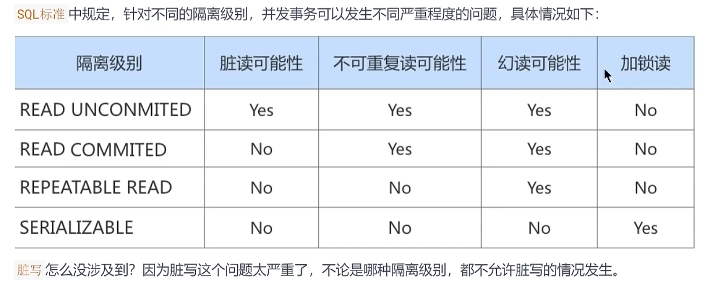

#### MySQL中设置事务的隔离级别 

查看隔离级别

```mysql
select @@transaction_isolation
```

设置隔离级别

```mysql
SET [GLOBAL|SESSION] TRANSACTION ISOLATION LEVEL 隔离级别; 
#其中，隔离级别格式: 
> READ UNCOMMITTED 
> READ COMMITTED 
> REPEATABLE READ 
> SERIALIZABLE
```

### 事务日志

事务有四大特性:**原子性**、**一致性**、**隔离性**、**永久性**；**隔离性**由**锁机制**实现，**原子性**、**一致性**和**持久性**都由事务的**redo日志**和**undo日志**来保证。

- **redo log**:重做日志，提供再写入操作，恢复提交事务修改的页操作，保证事务的**持久性**
- **undo log**:回滚日志，回滚行记录到某个特定的版本，用来保证事务的**原子性**和**一致性**

#### redo日志

innoDB引擎是以页为单位来管理存储空间的，在真正访问磁盘中的页时，需要先把磁盘中的页缓存到内存中的 **buffer pool** 。所有的增删改查都必须先更新缓冲池中的数据，然后缓冲池中的数据（**脏页，指内存中改动了但还未刷新到磁盘的页**）再以一定的频率刷入磁盘（**checkpoint机制**）。

由于**checkpoint**不是每次更改都会触发的，因此如果在触发前数据库宕机，那么缓冲池中的数据就丢失了。为了保证数据库的**持久性**，所以引入了redo日志。

> 如果取消缓冲池，每次数据有更新就刷入磁盘，也可以解决持久性的问题。但是同样是磁盘文件操作，为什么redo日志要优于这种方法？
>
> - 当我们要修改页中的一条数据时，需要先把整个页都加载到内存中进行修改，修改完成后再刷入磁盘。频繁的读取会严重浪费性能，而redo日志只是记录了物理日志，并不会读取页；
> - 当同时需要修改多个页时，磁盘的随机IO性能太差，而redo日志只需要做顺序IO。

##### redo日志的组成

- **重做日志缓冲（redo log buffer）**:保存在内存中的临时缓冲数据

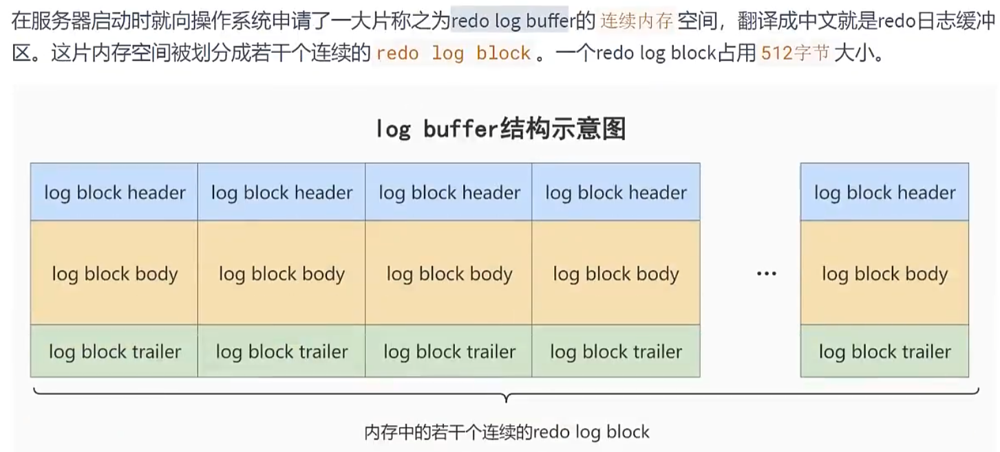

`redo log buffer` **默认大小16MB**，最大4096MB，最小1MB

查看当前 redo log buffer 大小:`show variables like '%innodb_log_buffer_size%'`

- **重做日志文件（redo log file）**:保存在磁盘中的持久化文件

位置:`/var/lib/mysql/ib_logfile0` 和 `/var/lib/mysql/ib_logfile1` 

##### redo日志的流程

**一个更新事务的流程**

1. 将原始数据从磁盘中读入内存中的缓冲池，在其中中修改数据
2. 生成一条redo日志并将日志写入`redo log buffer`，记录的是数据被修改后的值
3. 当事务commit时，将redo log buffer中的内容追加写入到`redo log file`中
4. 定期将缓冲池中的数据刷新到磁盘中

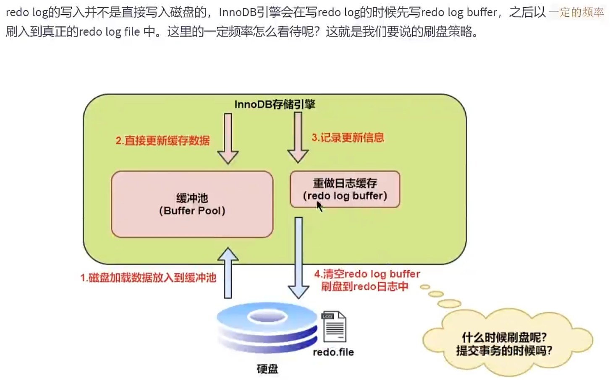

**redo log的刷盘策略**

redo log buffer刷盘到redo log file的过程并不是真正的刷到磁盘中去，只是刷入到**文件系统缓存（page cache）**中去（这是现代操作系统为了提高文件写入效率做的一个优化），真正的写入会交给系统自己来决定（比如page cache足够大了）。那么对于InnoDB来说就存在一个问题，如果交给系统来同步，同样如果系统宕机，那么数据也丢失了（虽然整个系统宕机的概率还是比较小的）。

针对这种情况，InnoDB给出 `innodb_flush_log_at_trx_commit` 参数，该参数控制 commit提交事务时，如何将 redo log buffer 中的日志刷新到 redo log file 中。它支持三种策略:

- 设置为0:表示每次事务提交时不进行刷盘操作。（系统默认master thread每隔1s进行一次重做日志的同步）
- 设置为1:表示每次事务提交时都将进行同步，刷盘操作（**默认值**） 
- 设置为2:表示每次事务提交时都只把 redo log buffer 内容写入 page cache，不进行同步。由os自己决定什么时候同步到磁盘文件。

查看刷盘策略: `show variables like 'innodb_flush_log_at_trx_commit'`

不同的刷盘策略对事务的执行性能有不同的影响，性能由高到低:**0 > 2 > 1**

**redo log file相关参数设置**

- `innodb_log_group_home_dir`:指定 redo log 文件组所在的路径，默认值为`./`，表示在数据库的数据目录下。MySQL的默认数据目录（`var/lib/mysql`）下默认有两个名为`ib_logfile0`和`ib_logfile1`的文件，log buffer中的日志默认情况下就是刷新到这两个磁盘文件中。此redo日志文件位置还可以修改。
- `innodb_log_files_in_group`:指明redo log file的个数，命名方式如:ib_logfile0，ib_logfile1... ib_logfilen。默认2个，最大100个。
- `innodb_log_file_size`:单个 redo log 文件设置大小，默认值为 48M 。最大值为512G，注意最大值指的是整个 redo log 系列文件之和，即（innodb_log_files_in_group * innodb_log_file_size）不能大于最大值512G。

**日志文件组**

从上面可以看出，磁盘上的redo日志文件不止一个，而是以一个日志文件组的形式出现的。这些文件以 `ib_logfile[数字]` 的形式命名，每个redo日志文件大小是一样的。

redo日志在写入日志文件组时，从 `ib_logfile0` 开始写，如果写满了，就写 `ib_logfile1` ；同理，当前一个文件写满时，就往下一个文件中写；当最后一个文件写满后，就重新回到 `ib_logfile0` 继续写。


**checkpoint**

>[【mysql】关于checkpoint机制 - 踏雪无痕SS - 博客园 (cnblogs.com)](https://www.cnblogs.com/chenpingzhao/p/5107480.html)

在整个日志文件组中还有两个重要的属性: write pos、checkpoint

- write pos 记录当前的位置，一边写一边后移
- checkpoint 是要擦除的位置

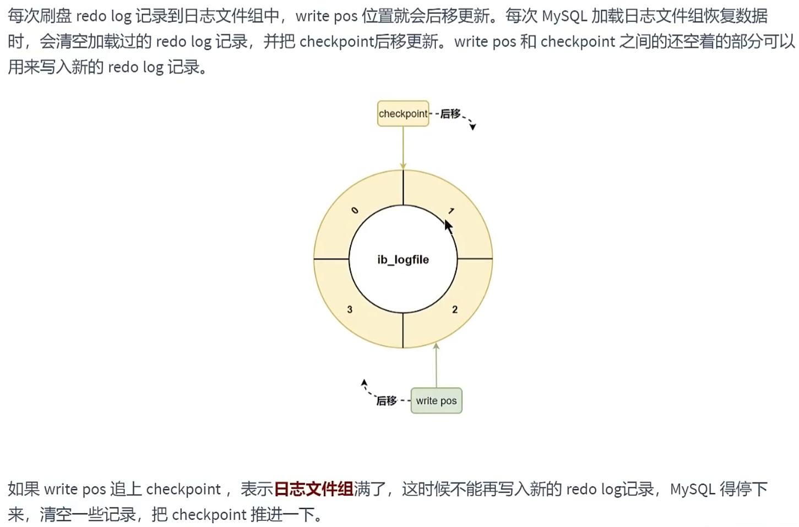

上图中，checkpoint左边是已经刷盘的数据，可以放心覆盖；右边是还未刷盘的数据，需要等待刷盘，checkpoint向前走之后才能覆盖

##### 小结

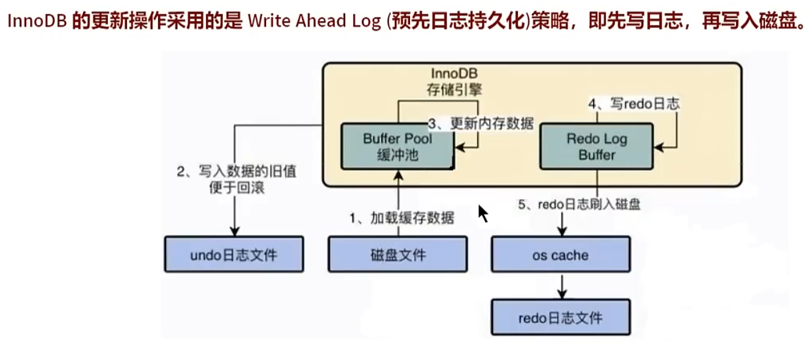

#### undo日志

> 参考:[MySQL回滚日志（undo log）总结_每天都要进步一点点的博客-CSDN博客_undolog](https://blog.csdn.net/Weixiaohuai/article/details/117867353)

undo日志用于存储每一个事务在执行更新数据之前的**原始数据**，以便于在事务回滚后恢复原数据，从而保证原子性。

**undo日志的作用**

- 回滚数据

undo日志并不会将数据库**物理**地恢复到执行事务之前的样子，undo是逻辑日志，只能将数据库逻辑地恢复到原来的样子，数据结构和页本身并不能完全恢复。

- MVCC（多版本并发控制）

当读取的某一行被其他事务锁定时，它可以从undo log中分析出该行记录以前的数据版本是怎样的，从而让用户能够读取到当前事务操作之前的数据（快照读）

##### undo日志的存储结构

InnoDB 对 undo log 的存储采用了分段方式进行存储（**回滚段 rollback segment**）。

一个回滚段中有1024个undo日志段，也就是说一个回滚段支持1024个undo日志操作。在InnoDB1.1之前，只支持1个回滚段。从InnoDB1.1开始，可以支持128个回滚段。从InnoDB1.2开始，可以通过参数对回滚段进行一些设置:

- **innodb_undo_directory**:设置回滚段的存放路径，默认值为InnodDB存储引擎的目录
- **innodb_undo_logs**:设置回滚段的数量，默认为128
- **innodb_undo_tablespaces**:设置构成回滚段的表空间文件的数量

**回滚段和事务的关系**

- 每个事务使用一个回滚段，每个回滚段在同一时刻可以服务于多个事务
- 事务产生的undo日志会不断填充回滚段中的区，当前的区不够使用时，会扩展至下一个区。如果回滚段中的所有区都被占满，事务会覆盖最初的区（在可被覆盖的情况下）。

**回滚段中的数据分类**

- 未提交的回滚数据:该数据所关联的事务并未提交，不能被其他事务的数据覆盖
- 已经提交但未过期的回滚数据:该数据所关联的事务已经提交，但是不能被其他事务数据覆盖
- 已经提交并且已经过期的数据:该数据所关联的事务已经提交，并且已经过期，会被优先覆盖

事务提交后并不能马上删除undo日志，因为可能还有其他事务要通过undo日志来得到之前版本的数据。

**undo日志的类型**

- insert undo log

事务在 insert 过程中产生的 undo log ，只对事务本身可见，因此在事务提交后可以直接删除。

- update undo log

事务在 update 和 delete 过程中产生的 undo log ，对其他事务可见，需要提供MVCC机制，因此不能再事务提交时删除。提交时放入 undo log 链表，等待 purge 线程进行最后的删除。

##### undo日志的生命周期

**undo日志的生成**

对于InnoDB引擎来说，每个行记录除了记录本身的数据外，还有几个隐藏列:

- **DB_ROW_ID**:如果没有显式地为表指定主键，并且表中也没有唯一索引，那么 InnoDB 会自动为每一行生成，作为隐藏主键
- **DB_TRX_ID**:每个事务都会分配一个事务ID，当事务对某条记录执行改动操作时，就会把这个ID写入到这里
- **DB_ROLL_PTR**:指向 undo log 的指针


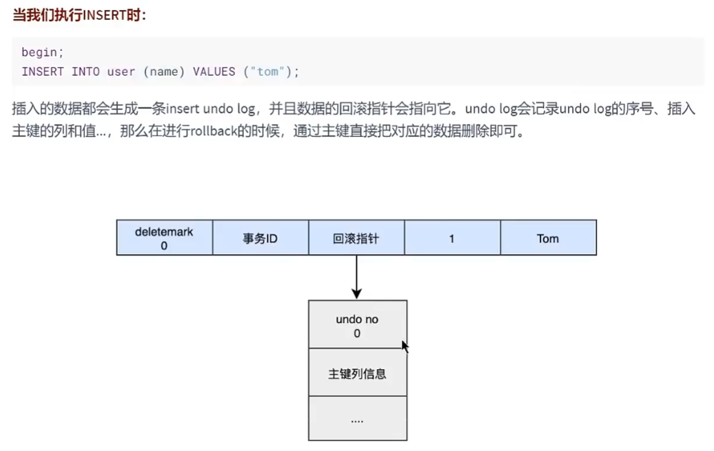


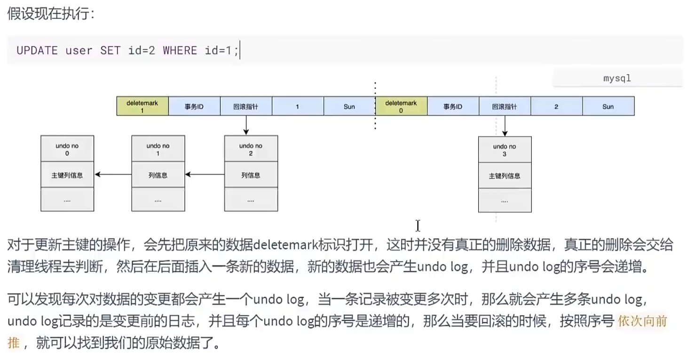

**undo日志的回滚**

针对上面的例子，执行 rollback 的流程:

1. 通过 undo no=3 的日志把 id=2 的数据删除
2. 通过 undo no=2 的日志把 id=1 的数据的 deletemark 还原成0
3. 通过 undo no=1 的日志把 id=1 的数据的 name 还原成 Tom
4. 通过 undo no=0 的日志把 id=1 的数据删除

**undo日志的删除**

- 对于 insert undo log 

由于只对事务本身可见，因此可以在事务提交后直接删除，不需要进行 purge 操作

- 对于 update undo log

由于对其他事务可见，可能会需要提供MVCC机制。因此事务提交时，会被放入undo日志链表，等待purge线程进行删除。

> purge的作用主要是**清理undo页**和**删除普通页中被标记的数据**。在InnoDB中，事务中的DELETE操作只会把数据行标记为删除，需要等待purge线程执行真正的删除操作。
>
> 参考:[MySQL purge 线程 - 腾讯云开发者社区-腾讯云 (tencent.com)](https://cloud.tencent.com/developer/article/1506737)

##### 小结

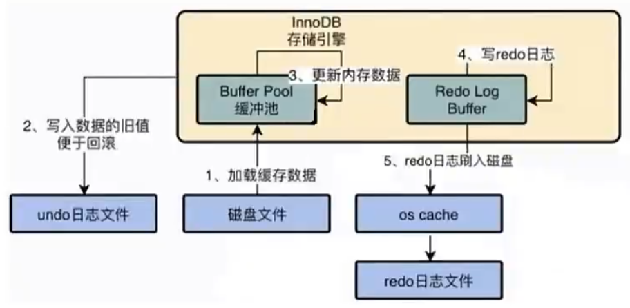

## 锁

> 参考:[一张图彻底搞懂 MySQL 的锁机制 | MySQL 技术论坛 (learnku.com)](https://learnku.com/articles/39212)

锁是一种用于管理共享资源的并发访问的机制，一般都由数据库或存储引擎根据当前的事务隔离级别自动添加，我们只需要了解它的机制即可。

### MySQL几种并发情况

**读-读并发**

不会对数据有影响，不需要处理。

**写-写并发**

会发生**脏写**问题，SQL规范的任何一个隔离级别都用锁解决了这个问题。

**读-写并发**

可能发生**脏读**、**不可重复读**、**幻读**的问题

**读-写并发问题的解决方案**

- 读写都加锁（读写操作彼此需要排队执行，性能低，但是读出来的数据始终是最新版本）
- 读操作采用MVCC，写操作加锁（读写操作不冲突，性能高，无法保证读出来的数据最新）

### 锁的分类

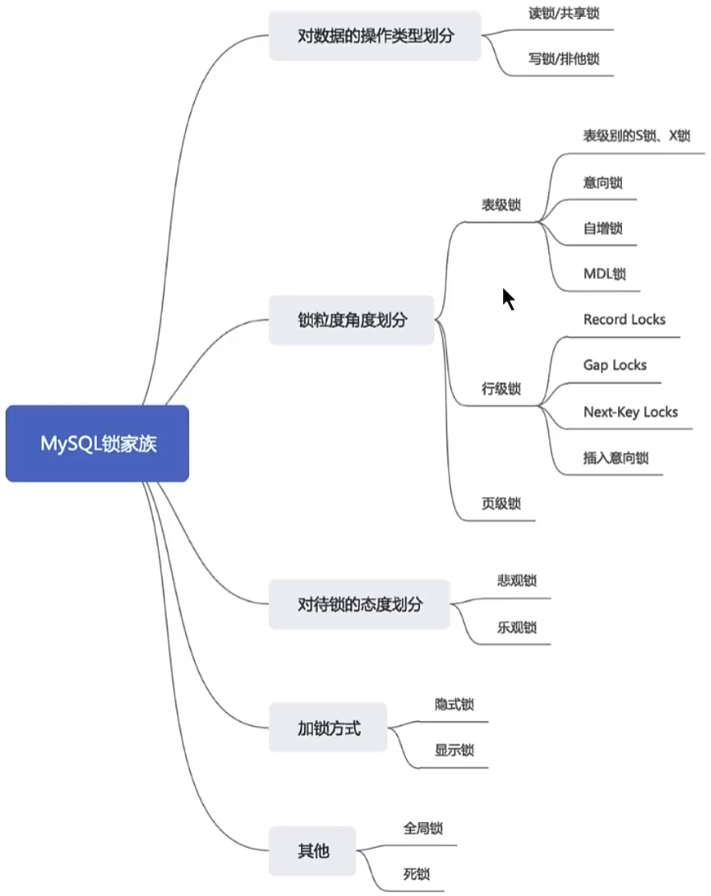

#### 从数据的操作类型划分

- **共享锁/读锁/S锁**:多个事务的读操作可以同时进行，不会相互影响也不会相互阻塞。
- **排他锁/写锁/X锁**:当前的写操作没有完成前，会阻塞其他写锁和读锁，确保在一段时间内，只有一个事务能执行写入，并且防止其他事务读取正在写入的资源。同理，在当前读操作执行时，也会阻塞其他的写操作。

在InnoDB中，共享锁和排他锁既可以作用在表上，也可以作用在行上。

读操作可以加共享锁和排他锁，写操作一般只加排他锁。

|        | 共享锁 | 排他锁 |
| :----: | :----: | :----: |
| 共享锁 |  兼容  | 不兼容 |
| 排他锁 | 不兼容 | 不兼容 |

**给读操作加锁**

- 给读操作加共享锁

  ```mysql
  SELECT ... LOCK IN SHARE MODE;
  # 或
  SELECT ... FOR SHARE; #(8.0新增语法)
  # 加的是表锁
  ```

- 给读操作加排他锁

  ```mysql
  SELECT ... LOCK IN UPDATE MODE;
  # 或
  SELECT ... FOR UPDATE; #(8.0新增语法)
  # 加的是表锁
  ```

**MySQL8.0新特性:**

在5.7及之前的版本，执行 `SELECT ... FOR UPDATE` ，如果获取不到锁，会一直等待，直到超时（`innodb_lock_wait_timeout`变量）。在8.0版本后，添加`NOWAIT`、`SKIP LOCKED`语法，跳过锁等待，或者跳过锁定。（`SELECT ... FOR UPDATE NOWAIT`）

- NOWAIT:如果查询的行已经加锁，会立即报错返回
- SKIP LOCKED:如果查询的行已经加锁，只返回结果中不包含被锁定的行

**给写操作加锁**

- 给写操作加排他锁

  ```mysql
  DELETE/INSERT/UPDATE ... LOCK IN UPDATE MODE;
  # 或
  SELECT ... FOR UPDATE; #(8.0新增语法)
  # 加的是表锁
  ```

**写操作和锁的具体执行过程**

- DELETE:对一条记录做DELETE操作的过程其实是先在B+树中定位到这条记录的位置，然后获取这条记录的X锁，再执行delete mark操作。
- UPDATE:在对一条记录做UPDATE操作时分为三种情况:
  - 情况1:未修改该记录的键值，并且被更新的列占用的存储空间在修改前后未发生变化。则先在B+树中定位到这条记录的位置，然后再获取一下记录的X锁，最后在原记录的位置进行修改操作。
  - 情况2:未修改该记录的键值，并且至少有一个被更新的列占用的存储空间在修改前后发生变化。则先在B+树中定位到这条记录的位置，然后获取一下记录的X锁，将该记录彻底删除掉（就是把记录彻底移入垃圾链表），最后再插入一条新记录。新插入的记录由INSERT操作提供的隐式锁进行保护。
  - 情况3:修改该记录的键值，则相当于在原记录上做DELECT操作之后再来一次INSERT操作。
- INSERT:一般情况下，新插入一条记录的操作并不加锁，通过一种称之为隐式锁的结构来保护这条新插入的记录在本事务提交前不被别的事务访问。

#### 从锁的粒度划分

- **表锁**:锁定整张表，是MySQL的基本锁策略，不依赖于存储引擎。**锁的粒度最大，冲突概率高，并发度低，开销低，不容易死锁**。
- **行锁**:锁定某一行，依赖于存储引擎实现。**锁的粒度最小，冲突概率低，并发度高，开销大，容易出现死锁**。
- **页锁**:锁定某一页，**各项属性介于表锁和行锁之间**。

每个层级的锁的数量是有限制的。由于锁会占用内存，锁空间的大小也有限制。当某个层级的锁的数量超过这个层级的上限时，就会进行**锁升级**，即用大粒度的锁取代小粒度的锁，从而降低锁空间的内存占用，但是会**降低并发度**。

不同粒度的锁之间不能共存。

##### 表锁分类

- 共享锁、排他锁

  **InnoDB**对某个表执行DML语句时（CRUD），不会自动添加表级的S锁和X锁；执行 `ALTER TABLE` 之类的DDL语句时，阻塞其他的DML语句；同理，执行DML语句也会阻塞DDL语句。而**MyISAM**在执行查询语句前，会给涉及的所有表加读锁，在执行增删改操作前，会给涉及的表加写锁。

  手动给表加锁:`lock tables t read/write` （一般不用）

  查看加锁的表:`show open tables where in_use > 0`

  手动解锁所有表:`unlock tables`

- 意向锁（intention lock）

  意向锁是一种特殊的表锁，它**可以和行锁共存**。**意向锁的作用是让粒度更高的锁知道其中是否上过粒度小的锁（因此意向锁相互之间都是兼容的）**。如果没有意向锁，当一个事务想要给一张表加表锁时，需要遍历该表的所有行，查看其中是否有行锁。

  当我们给某一行数据加上行锁时，会自动给更高粒度的空间（页、表）上一个意向锁。这样当其他事务需要给这个空间上更高粒度的锁时，就不用再遍历了。

  意向锁也分为意向共享锁，意向排他锁，自动根据行锁的类型进行选择。
  
- 自增锁（auto inc）

  当表中有自增字段（auto increment）时，为了确保自增字段是连续自增的，就需要自增锁来实现。当执行插入时，就会自动添加一个表级的自增锁，执行完毕后再释放。由于每条插入语句都需要参与自增锁的竞争，并发度很低，所以可以通过 `innodb_autoinc_lock_mode` 变量来改变锁定机制。

  > MySQL的插入分成三种:简单插入、批量插入、混合插入。
  >
  > **简单插入**是指可以预先知道插入的行数的语句，例如没有嵌套子查询的 insert；
  >
  > **批量插入**是指不能预先知道插入的行数的语句，例如嵌套子查询的 insert；
  >
  > **混合插入**与简单插入类似，但是部分数据手动指定了自动递增字段的值。

  **innodb_autoinc_lock_mode = 0**

  传统的模式，每个插入语句都添加一个表级自增锁。

  **innodb_autoinc_lock_mode = 1**

  MySQL8.0之前的默认值。在这种情况下，批量插入仍然使用自增锁，但是简单插入则使用 mutex （轻量级锁，只在分配过程中保持）来获取所需数量的自动低增值。

  **innodb_autoinc_lock_mode = 2**

  MySQL8.0后的默认值。在这种情况下，所有的插入语句都不会使用自增锁，但是执行批量插入时，生成的自增字段的值可能不连续。

  > 更多关于自增字段的细节参考:[MySQL自增主键为什么不连续 - 腾讯云开发者社区-腾讯云 (tencent.com)](https://cloud.tencent.com/developer/article/1974491)

- 元数据锁（DML）

  元数据锁的作用是保证读写的正确性不被表结构影响。

  当对表做CRUD操作时，自动加元数据读锁；当对表结构做变更操作时，自动加元数据写锁。

  读锁与读锁兼容，读锁与写锁、写锁与写锁不兼容。

##### 行锁分类

- 记录锁（record locks）

  字面意思，给一条行记录加锁，也是最常用的锁。记录锁也分为读锁和写锁，规则与表级的相同。

- 间隙锁（gap locks）

  间隙锁用于解决幻读问题（也可以用MVCC解决）。

  插入间隙锁后，不允许其他事务在两条记录之间插入新数据。

  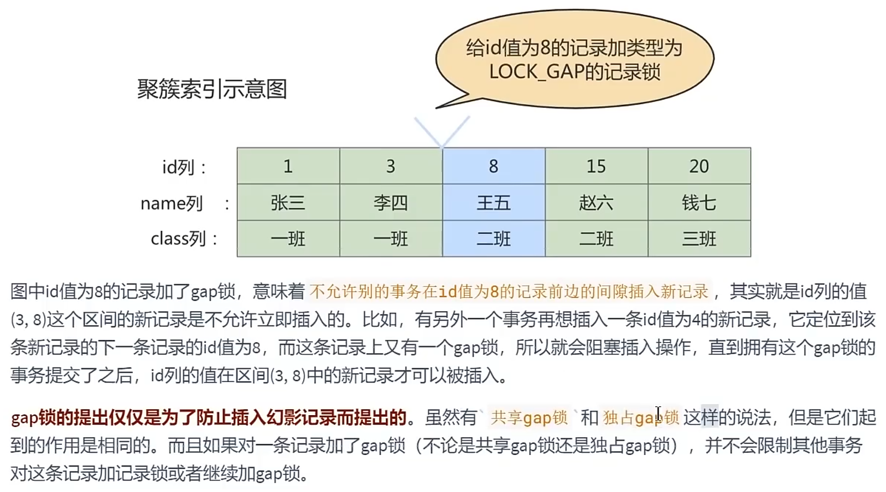

- 临键锁（Next-key locks）

  相当于是记录锁和间隙锁的结合体，是InnoDB的默认锁。

  

- 插入意向锁（insert intention locks）

  > [MySQL InnoDB中的锁-插入意向锁（Insert Intention Lock）_小厂程序员的博客-CSDN博客_插入意向锁](https://blog.csdn.net/fofcn/article/details/123219466)

#### 从对待锁的态度划分

- **悲观锁**:总是假设最坏的情况，每次拿数据时都会加锁。例如行锁、表锁、读锁、写锁等。
- **乐观锁**:认为并发操作是小概率事件，不对操作加锁，而是在更新时判断在此期间数据有没有被改动。可以通过版本号或CAS机制实现。（JUC的atomic就是通过CAS实现的）

悲观锁和乐观锁是锁的设计思想，而不是具体的某个锁。

**乐观锁版本号机制**

在表中设计一个`version`字段，对行数据的更新操作执行都执行以下步骤:

1. 读取行数据和`version`的值。
2. 在内存中对行数据进行操作。
3. 再次读取`version`的值。
4. 将`version`在3中的值与1中的值进行比较，如果相同则将行数据更新到磁盘，并且把磁盘中的`version`值+1；如果不同则从1重新开始。

**两种锁的适用场景**

- 乐观锁:适合读多写少。
- 悲观锁:适合写多读少。

#### 从加锁的方式划分

- **显式锁**:（存储引擎或数据库自动生成、手动添加）创建锁结构来起到锁的作用。
- **隐式锁**:不创建锁结构，也可以起到锁的作用。

隐式锁的主要应用 场景是插入语句。每条行记录（聚簇索引的叶子节点）中都有一个`trx_id`属性，表示最近对这条记录进行操作的事务的id。如果有事务2要对这条数据添加锁，会先看这条记录的`trx_id`表示的事务1是否处于活跃状态。如果是，则表明该条数据还在被事务1操作中，那么事务2会帮其创建一个锁，并且自身进入等待事务1的状态中。这种情况就是隐式锁转化为显式锁。

> 参考:[MySQL InnoDB隐式锁功能解析 - 知乎 (zhihu.com)](https://zhuanlan.zhihu.com/p/408491837)

#### 全局锁

对整个数据库进行加锁，让整个库处于只读状态。

使用场景:全库逻辑备份。

#### 死锁

两个事务互相持有对方需要的锁，并且等待对方释放，双方都不会释放自己的锁。

**产生死锁的必要条件**

1. 两个或以上的事务
2. 每个事务都已经持有锁并且申请新的锁
3. 锁资源同时只能被同一个事务持有或者不兼容
4. 事务之间因为持有锁和申请锁导致彼此循环等待

死锁的关键在于每个事务加锁的顺序不一致。如果一致，不会形成死锁。

**解决死锁的方法**

1. 等待，直到超时

   两个事务相互等待时，当一个事务等待事件超过阈值时，就将其回滚，从而释放锁，让另一个事务继续执行。通过`innodb_lock_wait_timeout`设置等待时间，默认50s。

   缺点:等待时间不好设置，太长影响业务正常执行，太短容易误伤正常事务的的等待。

2. 使用死锁检测进行处理 

   使用**wait-for graph**算法检测死锁。`innodb_deadlock_detect`开启或关闭。

   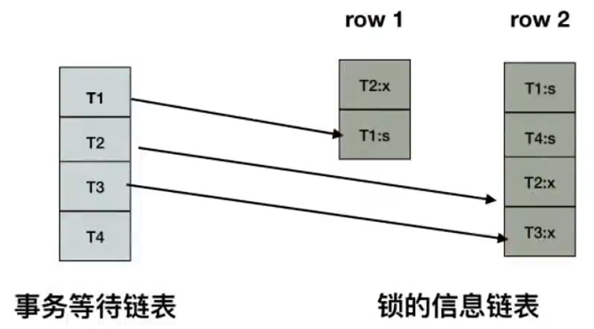

   

   构建出以事务为点，锁为边的有向图，如果图中存在环，则存在死锁。innobb引擎就会选择回滚undo量最小的事务，让其他事务继续执行。

   缺点:算法本身需要耗费时间，如果同时并发的事务太多，会影响性能。

   解决方法:用其他中间件对更新相同行的操作进行排队。

**如何避免死锁**

- 合理设计索引，使业务SQL尽可能通过索引定位更少的行，减少锁竞争。
- 调整业务SQL执行顺序，避免update/delete等长时间持有锁的SQL在事务前面。
- 避免大事务，尽量拆分成多个小事务处理。
- 降低隔离级别。
- 在并发高的场景下不要在事务中手动加锁。

> 参考:[彻底搞懂MySQL死锁_AlbenXie的博客-CSDN博客_mysql死锁](https://blog.csdn.net/AlbenXie/article/details/118613349)

### 锁的内存结构

给一条记录加锁的本质就是在内存中创建一个与之关联的锁结构。

加锁时，并不会对每条记录都创建一个锁结构，而是为了节约空间，将满足一些条件的记录都用同一个锁结构表示:

- 同一个事务中的加锁操作
- 被加锁的记录在同一个页中
- 加锁的类型一样
- 等待状态一样


**结构解析**

1. 锁所在的事务信息:记录锁的基础信息的指针。

2. 索引信息:（行锁特有）记录加锁的记录的索引信息的指针。

3. 表锁/行锁信息:

   - 表锁:记录当前表和一些其他信息。
   - 行锁:记录当前行所在的表空间(Space ID)、页号(Page Number)、行标记(n_bits)。

4. type_mode:

   一个32位的数，被分为 `lock_mode` 、`lock_type` 、`rec_lock_type` 三个部分。

   

   - lock_mode:表示当前锁的模式
     - LOCK_IS（十进制的0）:表示共享意向锁，也就是IS锁。 
     - LOCK_IX（十进制的1）:表示独占意向锁，也就是IX锁。 
     - LOCK_S（十进制的2）:表示共享锁，也就是S锁。 
     - LOCK_X（十进制的3）:表示独占锁，也就是X锁。 
     - LOCK_AUTO_INC（十进制的4）:表示AUTO-INC锁。 

   - lock_type:表示当前锁的类型
     - LOCK_TABLE（十进制的1，即第1个bit为1）:表示表级锁
     - LOCK_REC（十进制的2，即第2个bit为1）:表示行级锁
   - rec_lock_type:行锁的具体类型
     - LOCK_ORDINARY（十进制的0）:表示next-key锁。 
     - LOCK_GAP（十进制的512，即第10个bit为1）:表示gap锁。 
     - LOCK_REC_NOT_GAP（十进制的1024，即第11个bit为1）:表示记录锁。
     - LOCK_INSERT_INTENTION（十进制的2048，即第11个bit为1）:表示插入意向锁。
     - 补充:十进制的1，即第1个bit为1时，表示is_waiting=true，即当前事务处在等待状态，尚未获取到锁；为0时，表示is_waiting=false，即当前事务获取锁成功。

5. 其他信息:为了更好的管理各种锁结构而设计的哈希表和链表。

6. 比特位:如果是行锁结构的话，在该结构末尾还放置了一堆比特位，比特位的数量是由上边提到的n_bits属性表示的。InnoDB数据页中的每条记录在记录头信息中都包含一个 heap_no 属性，伪记录Infimum的heap_no值为0，Supremum的heap_no值为1，之后每插入一条记录，heap_no值就增1。锁结构最后的一堆比特位就对应着一个页面中的记录，一个比特位映射一个heap_no，即一个比特位映射到页内的一条记录。

### 锁的监控

```mysql
mysql> show status like 'innodb_row_lock%';
```

- `Innodb_row_lock_current_waits`:当前正在等待锁定的数量；
- `Innodb_row_lock_time`:从系统启动到现在锁定总时间长度；（等待总时长）
- `Innodb_row_lock_time_avg`:每次等待所花平均时间；（等待平均时长）
- `Innodb_row_lock_time_max`:从系统启动到现在等待最常的一次所花的时间；
- `Innodb_row_lock_waits`:系统启动后到现在总共等待的次数；（等待总次数）

**其他监控方法:**

MySQL把事务和锁的信息记录在了`information_schema`库中，涉及到的三张表分别是`INNODB_TRX`、`INNODB_LOCKS`和`INNODB_LOCK_WAITS`。 

MySQL5.7及之前，可以通过information_schema.INNODB_LOCKS查看事务的锁情况，但只能看到阻塞事务的锁；如果事务并未被阻塞，则在该表中看不到该事务的锁情况。

MySQL8.0删除了information_schema.INNODB_LOCKS，添加了`performance_schema.data_locks`，可以通过performance_schema.data_locks查看事务的锁情况，和MySQL5.7及之前不同，performance_schema.data_locks不但可以看到阻塞该事务的锁，还可以看到该事务所持有的锁。

同时，information_schema.INNODB_LOCK_WAITS也被`performance_schema.data_lock_waits`所代替。

## 多版本并发控制（MVCC）

> 参考:1,[MySQL 如何解决幻读（MVCC 原理分析） - 掘金 (juejin.cn)](https://juejin.cn/post/7056583607929798692)

### 概述

MVCC（Multiversion Concurrency Control），多版本并发控制。通过数据行的多个版本管理来实现数据库的并发控制。相比于用锁来实现并发控制，MVCC的并发能力更高（只有写-写之间相互阻塞），但是无法保证读出的数据是最新版本。

**快照读和当前读**

- 快照读

  又叫一致性读，读取的是快照数据而不是实时的最新数据。不会与写操作冲突。**不加锁的简单的SELECT都是快照读**。快照读的幻读由MVCC解决，这里的快照就是使用的事务开始那个时刻的快照

- 当前读

  读取的是最新版本，与写操作冲突，要保证读取过程中其他并发事务不能修改当前记录。**加锁的SELECT或增删改操作都会执行当前读**。当前读的幻读由临键锁解决。

### MVCC实现原理

MVCC实现依赖于:版本链（trx_id和roll_pointer）、Undo日志、ReadView

#### 版本链

之前讲过在InnoDB行格式中，每个聚簇索引都包含三个隐藏列

| 列名             | 是否必须 | 说明                                                         |
| ---------------- | -------- | ------------------------------------------------------------ |
| row_id           | 否       | 创建的表中有主键或者非 NULL的 UNIQUE 键时都不会包含 row_id 列 |
| **trx_id**       | 是       | 事务ID，每次一个事务对某条聚簇索引记录进行改动时，都会把该事务的事务 id 赋值给 trx_id 隐藏列 |
| **roll_pointer** | 是       | 回滚指针，每次对某条聚簇索引记录进行改动时，都会把旧的版本写入到 undo 日志中，然后用 roll_pointer 指向这个旧的版本。同时，旧的版本也会有一个自己的 roll_pointer 指向更旧的一个版本。 |

每次对记录进行改动，都会生成一条 undo 日志，每条 undo 日志也都有一个 roll_pointer 属性（INSERT 操作对应的 undo 日志没有该属性，因为该记录并没有更早的版本），可以将这些 undo 日志都连起来，串成一个链表，就是版本链。

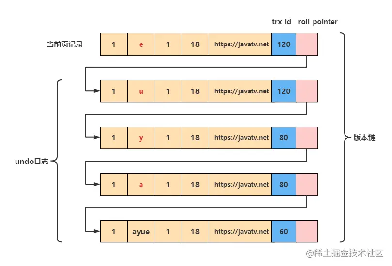

#### Undo日志

Undo日志除了可以保证事务在`rollback`时的原子性和一致性，还可以用于存放MVCC的快照读的数据。

#### ReadView

上面说到，改动的记录都在undo日志中，那如何选择到底读取哪个版本的记录呢？

- 对于使用 `READ UNCOMMITTED` 隔离级别的事务来说，由于**可以读到未提交事务修改过的记录**，所以直接读取记录的最新版本就好了。
- 对于使用 `SERIALIZABLE` 隔离级别的事务来说，InnoDB 使用**加锁的方式来访问记录**，不存在并发问题。
- 对于使用 `READ COMMITTED` 和 `REPEATABLE READ` 隔离级别的事务来说，都**必须保证读到**已经**提交**了的事务修改过的记录，也就是说**假如另一个事务已经修改了记录但是尚未提交，是不能直接读取最新版本的记录的**。

核心问题就是:`READ COMMITTED` 和 `REPEATABLE READ` 隔离级别在不可重复读和幻读上的区别在哪里？这两种隔离级别对应的**不可重复读**与**幻读**都是指**同一个事务**在两次读取记录时出现**不一致**的情况，**这两种隔离级别关键是需要判断版本链中的哪个版本是当前事务可见的**。

ReadView 就可以用来帮助我们解决可见性问题。事务进行**快照读**操作的时候就会产生 ReadView，它保存了**当前事务开启时所有活跃的事务列表**（活跃指的是未提交的事务）。

ReadView中主要保存了以下几个比较重要的内容:

1. `creator_trx_id`，创建这个 ReadView 的事务 ID。

> 说明:只有在对表中的记录做改动时（执行INSERT、DELETE、UPDATE这些语句时）才会为事务分配事务id，否则在一个只读事务中的事务id值都默认为0。 

2. `m_ids`，生成 ReadView 时当前系统中活跃的读写事务的事务 id 列表。 

3. `min_trx_id`，生成 ReadView 时当前系统中活跃的读写事务中最小的事务 id 也就是 m_ids 中的最小值。 

4. `max_trx_id`，表示生成ReadView时系统中应该分配给下一个事务的id值。

> 注意:`max_trx_id` 并不是 `m_ids` 中的最大值，事务id是递增分配的。比如，现在有id为1，2，3这三个事务，之后id为3的事务提交了。那么一个新的读事务在生成ReadView时，m_ids就包括1和2，min_trx_id的值就是1，max_trx_id的值就是4。

在有了 ReadView 之后，在访问某条记录时，只需要按照下边的步骤判断记录的某个版本是否可见:

1. `trx_id = creator_trx_id` ，**可访问**

   如果被访问版本的 trx_id 属性值与 ReadView 中的 creator_trx_id 值相同，意味着当前事务在访问它自己修改过的记录，所以该版本可以被当前事务访问。

2. `trx_id < min_trx_id` ，**可访问**

   如果被访问版本的 trx_id 属性值小于 ReadView 中的 min_trx_id 值，表明生成该版本的事务在当前事务生成 ReadView 前已经提交，所以该版本可以被当前事务访问。

3. `trx_id >= max_trx_id` ，**不可访问**

   如果被访问版本的 trx_id 属性值大于或等于 ReadView 中的 max_trx_id 值，表明生成该版本的事务在当前事务生成 ReadView 后才开启，所以该版本不可以被当前事务访问。

4. `min_trx_id <= trx_id < max_trx_id`，并且存在 `m_ids` 列表中，**不可访问**

   如果被访问版本的 trx_id 属性值在 ReadView 的 min_trx_id 和 max_trx_id 之间，那就需要判断一下 trx_id 属性值是不是在 m_ids 列表中，如果在，说明创建 ReadView 时生成该版本的事务还是活跃的，该版本不可以被访问；如果不在，说明创建 ReadView 时生成该版本的事务已经被提交，该版本可以被访问。

5. 某个版本的数据对当前事务不可见

   如果某个版本的数据对当前事务不可见的话，那就顺着版本链找到下一个版本的数据，继续按照上边的步骤判断可见性，依此类推，直到版本链中的最后一个版本。如果最后一个版本也不可见的话，那么就意味着该条记录对该事务完全不可见，查询结果就不包含该记录。

在 MySQL 中，READ COMMITTED 和 REPEATABLE READ 隔离级别的的一个非常大的区别就是它们**生成 ReadView 的时机不同**。

当事务处在READ COMMITTED中，**事务中的每条读语句都会重新生成一个ReadView**，这意味着历史版本对于这个事务的读操作是会不断变化的，因此有可能导致连续的两次读取内容不同，也就是不可重复读。

当事务处在REPEATABLE READ中，**事务中只有第一条读语句会生成一个ReadView**，后面的所有读操作都会沿用第一次的ReadView，从而保证每次读取的内容都一致。这样也就一次性解决了不可重复读和幻读的问题。

>需要注意的一点:因为ReadView是只对快照读生效的，所以MVCC并不能完全解决幻读问题。当前读的幻读问题需要`Next-key Locks`解决。

### 总结

MVCC在可重复读的隔离级别下解决了以下问题:

1. 通过历史版本，让读-写操作可以并发执行，提高了并发效率。
2. 解决了脏读、不可重复读、（快照读情况下）幻读。

## 其他数据库日志

> 参考:[[玩转MySQL之八\]MySQL日志分类及简介 - 知乎 (zhihu.com)](https://zhuanlan.zhihu.com/p/58011817)

在MySQL中，除了之前提到的Redo日志和Undo日志外，还有一些其他不同功能的日志。

- **慢查询日志**:记录所有执行时间超过`long_query_time`的查询。
- **通用查询日志**:记录所有链接的起始时间和终止时间，以及连接发送给数据库服务器的所有指令。
- **错误日志**:记录MySQL服务的启动、运行、停止时遇到的各种错误。
- **二进制日志**:记录所有更改数据的语句，用于主从服务器之间的数据同步，以及服务器遇到故障后的恢复。
- **中继日志**:用于主从服务器架构中，从服务器用来存放主服务器二进制日志内容的一个中间文件（MySQL8.0以后新增）。
- **数据定义语言日志**:记录数据定义语句执行的元数据操作（MySQL8.0以后新增）。

除了二进制日志，其他日志都是文本文件。默认情况下，所有日志都创建在MySQL数据目录中。

### 慢查询日志

前面性能分析工具写过了，不再赘述。

### 通用查询日志

通用查询日志用来记录用户的所有操作，包括启动和关闭MySQL服务、所有用户的连接开始时间和截止时间、发给 MySQL 数据库服务器的所有 SQL 指令等。

由于通用查询日志记录的数据非常多，因此只建议在测试环境下开启。

**查看当前通用查询日志的状态**

```mysql
mysql> show variables like '%general_log%';
+------------------+------------------------------+
| Variable_name    | Value                        |
+------------------+------------------------------+
| general_log      | OFF                          |
| general_log_file | /var/lib/mysql/DB-Server.log |
+------------------+------------------------------+
```

- 参数`general_log`用来控制开启、关闭MySQL查询日志
- 参数`general_log_file`用来控制查询日志的位置

**设置通用查询日志的存储方式**

可以通过`log_output`设置通用查询日志的存储方式:

- `FILE`:表示日志存储在文件中。
- `TABLE`:表示日志存储在mysql库中的`general_log表`中。
- `FILE, TABLE`:表示将日志同时存储在文件和`general_log表`中，会徒增很多IO压力，一般不会这样设置。
- `NONE`:表示不记录日志，即使`general_log`设置为ON，如果`log_output`设置为NONE，也不会记录查询日志。

```mysql
mysql> show variables like 'log_output';
+---------------+-------+
| Variable_name | Value |
+---------------+-------+
| log_output    | FILE  |
+---------------+-------+
```

> 注意:`log_output`参数不止用于设置通用查询日志的存储方式，也同样会影响慢查询日志。

**开启/关闭通用查询日志**

- 方法一:修改`my.cnf`配置文件，需要重启MySQL服务，修改后永久生效。

  ```ini
  [mysqld]
  general_log = 1/0
  ```

- 方法二:命令行设置，重启后会失效。

  ```
  set global general_log = 1/0
  ```

### 错误日志

错误日志默认开启，并且无法被关闭。默认情况下，错误日志存储在数据库的数据文件目录中，名称为`hostname.err`，其中，hostname为服务器主机名。

**查看错误日志配置**

```mysql
mysql> show variables like 'log_err%';
+----------------------------+----------------------------------------+
| Variable_name              | Value                                  |
+----------------------------+----------------------------------------+
| log_error                  | ./fengye.err                           |
| log_error_services         | log_filter_internal; log_sink_internal |
| log_error_suppression_list |                                        |
| log_error_verbosity        | 2                                      |
+----------------------------+----------------------------------------+
```

**删除错误日志**

MySQL5.5.7之前，可以用`mysqladmin –u root –pflush-logs`命令，直接将旧文件重命名为`filename.err._old`，并创建新文件；从MySQL5.5.7开始，只能手动重命名后，开启一个新的错误日志文件:

```
[root@fengye data]# mv fengye404.err  fengye404.err._old
[root@fengye data]# mysqladmin flush-logs
```

### 二进制日志

> 参考:[mysql binlog详解 - Presley - 博客园 (cnblogs.com)](https://www.cnblogs.com/Presley-lpc/p/9619571.html)

MySQL的二进制日志（binary log）是一个二进制文件，主要记录所有数据库表结构变更（例如CREATE、ALTER TABLE…）以及表数据修改（INSERT、UPDATE、DELETE…）的所有操作，并且记录了语句发生时间、执行时长、操作数据等其它额外信息。

**binlog的应用场景**

- 数据恢复:如果MySQL服务意外停止，可以通过binlog来恢复。
- 数据复制:主数据库向从数据库复制数据。

**binlog和redolog的区别**

1. redolog由InnoDB产生；binlog由MySQL数据库产生。
2. redolog是物理日志，记录了”某个页上做了什么修改“；biglog是逻辑日志，存储对应的SQL语句。
3. redolog的空间是固定的，循环写入；binlog空间没有限制，追加写入。
4. redolog一般对于用户不可见，由存储引擎维护并保证数据库崩溃时事务的持久性；binlog用于人工恢复数据。

**查看binlog配置**

```mysql
mysql> show variables like '%log_bin%';
+---------------------------------+----------------------------------+
| Variable_name                   | Value                            |
+---------------------------------+----------------------------------+
| log_bin                         | ON                               |
| log_bin_basename                | /www/server/data/mysql-bin       |
| log_bin_index                   | /www/server/data/mysql-bin.index |
| log_bin_trust_function_creators | OFF                              |
| log_bin_use_v1_row_events       | OFF                              |
| sql_log_bin                     | ON                               |
+---------------------------------+----------------------------------+
```

- log_bin:是否开启binlog，MySQL8默认开启
- log_bin_basename:binlog日志不止一个文件，由多个文件组成（每次MySQL重启都会创建一个新的binlog）。这个参数表示binlog的基本文件名，每个文件后面都会追加标识来表示每个文件。
- log_bin_index:binlog文件的索引文件。由于binlog可能包含很多文件，因此需要一个索引来管理。
- log_bin_trust_function_creators:是否可以创建存储过程。（具体参考:[MySQL参数log_bin_trust_function_creators介绍 - 潇湘隐者 - 博客园 (cnblogs.com)](https://www.cnblogs.com/kerrycode/p/7641835.html)）

**修改binlog配置**

- 方法一:修改`my.cnf`配置文件，需要重启MySQL服务，修改后永久生效。

  ```ini
  [mysqld]
  log-bin=fengye404-bin
  # binlog的基础文件名，当带上路径时，也会同时指定文件存放的路径
  binlog_expire_logs_seconds=3600
  # binlog文件的过期时间，单位是秒，超过时间后会删除，不设置默认30天
  max_binlog_size=100M
  # 单个binlog文件的大小，超过大小时会自动创建新的文件，不设置默认1GB
  ```

- 方法二:命令行设置，重启后会失效（不支持global，只支持session）。

  ```mysql
  mysql> SET sql_log_bin=0; 
  ```

**查看binlog列表**

```mysql
mysql> show binary logs;
+------------------+-----------+-----------+
| Log_name         | File_size | Encrypted |
+------------------+-----------+-----------+
| mysql-bin.000014 |  21784592 | No        |
| mysql-bin.000015 |  11311449 | No        |
+------------------+-----------+-----------+
```

**查看binlog内容**

由于binlog是二进制文件，无法直接查看，需要借助`mysqlbinlog`命令工具

```shell
mysqlbinlog "/www/server/data/mysql/mysql-bin.000015"
```

除了使用mysqlbinlog工具，还可以使用下面这种更加方便的查询命令:

```mysql
mysql> show binlog events [IN 'log_name'] [FROM pos] [LIMIT [offset,] row_count];
```

- `IN 'log_name'`:指定要查询的binlog文件名（不指定就是第一个binlog文件）　
- `FROM pos`:指定从哪个pos起始点开始查起（不指定就是从整个文件首个pos点开始算）
- `LIMIT [offset]`:偏移量(不指定就是0) 
- `row_count`:查询总条数（不指定就是所有行）

例子:`show binlog events in "/www/server/data/mysql/mysql-bin.000015";`

**查看binlog格式**

```mysql
mysql> show variables like 'binlog_format';
+---------------+-------+
| Variable_name | Value |
+---------------+-------+
| binlog_format | MIXED |
+---------------+-------+
```

- STATEMENT:记录每一条修改数据的SQL语句。

  优点:不需要记录每一行的变化，减少了binlog的日志量，节约IO，提高性能。

- ROW:不记录SQL语句，而是记录那些行被修改。

  优点:清楚地记录每一行数据修改地细节，不会出现某些特定情况下存储过程、函数、trigger的调用导致的无法正确复制的问题。

- MIXED:Statement和Row的结合

**使用binlog恢复数据**

```shell
mysqlbinlog [option] <filename> | mysql –u [username] -p [password] -v [database];
```

- filename:文件完整路径
- option:可选参数。比较重要的两对option参数是--start-date、--stop-date 和 --start-position、-- stop-position。 
  - `--start-date` 和 `--stop-date`:可以指定恢复数据库的起始时间点和结束时间点。
  - `--start-position` 和 `--stop-position`:可以指定恢复数据的开始位置和结束位置。
- username、password、database:用户名、密码、指定的数据库

> 注意:使用binlog恢复数据的同时，也相当于对数据库中的数据进行改动。因此恢复数据的操作也会被同时写入binlog。因此在恢复之前最好使用`flush logs`重新开启一个新的binlog文件。

**删除binlog文件**

```mysql
mysql>PURGE {MASTER | BINARY} LOGS TO '指定日志文件名';
# 删除指定文件之前的（不包括指定文件）文件
mysql>PURGE {MASTER | BINARY} LOGS BEFORE '指定日期';
```

### 中继日志

**中继日志只在主从服务器架构的从服务器上存在**。从服务器为了与主服务器保持一致，要从主服务器读取binlog的内容，并且把读取到的信息写入本地的日志文件中，这个从服务器本地的日志文件就叫**中继日志**。然后，从服务器读取中继日志，并根据中继日志的内容对从服务器的数据进行更新，完成主从服务器的数据同步。

文件名格式:`从服务器名 -relay-bin.序号`。中继日志也有一个索引文件`从服务器名 -relay-bin.index`

中继日志的格式与二进制日志相同，也需要用`mysqlbinlog`查看

## 主从复制

> 参考:[小白都能懂的Mysql主从复制原理（原理+实操） - 知乎 (zhihu.com)](https://zhuanlan.zhihu.com/p/164518315)

在实际的生产环境中，一般都是读多写少，为了提高性能，会采用主从复制的方式进行**读写分离**。即在主数据库（master）中写入数据，从数据库（slave）中读取数据。

### 原理

主从复制的过程主要由三个线程参与:

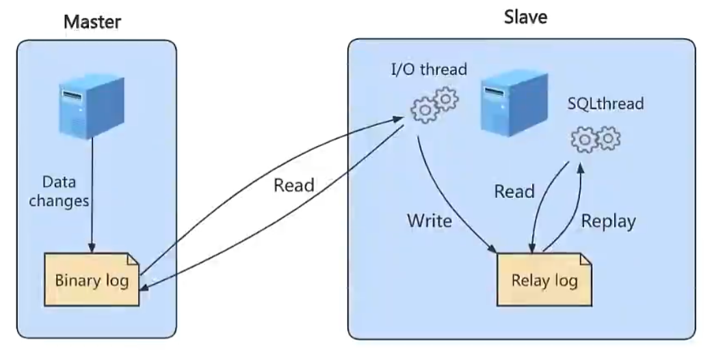

- master（binlog dump thread）:主库线程，主库数据更新时，将更新事件写入主库的binlog，并且通知从库数据有更新。
- slave（I/O thread）:从库线程，读取主库的binlog并写入从库的relay log。
- slave（SQL thread）:从库线程，读取从库的relay log并执行SQL语句，将数据更新到从库的表中。

> 注意:要实现主从复制，必须要求主库开启binlog

### 搭建主从复制

#### 主机配置文件

my.cnf

```ini
[mysqld]
# [必选] 主服务器唯一ID
server-id=1

# [必选] 启用binlog，并指定基础文件名，当带上路径时，也会同时指定文件存放的路径
log-bin=fengye404

# [可选] 0（默认）表示读写（主机），1表示只读（从机）
read-only=0

# [可选] binlog保留时长，单位为秒，不填默认30天
binlog_expire_logs_seconds=6000

# [可选] 单个binlog文件最大大小，默认1GB
max_binlog_siez=200M

# [可选] 忽略的数据库，一般忽略mysql自带的数据库
binlog-ignore-db=mysql
binlog-ignore-db=information_schema
binlog-ignore-db=performance_schema
binlog-ignore-db=sys

# [可选] 记录binlog的数据库，默认全部
binlog-do-db=test

# [可选] 设置binlog格式
binlog_format=MIXED
```

#### 从机配置文件

```ini
[mysqld]
# [必选] 从服务器唯一ID
server-id=2

# [必选] 启用relaylog，并指定基础文件名，当带上路径时，也会同时指定文件存放的路径
relay-log=fengye404

# [可选] 0（默认）表示读写（主机），1表示只读（从机）
read-only=0
```

~~由于每台服务器的情况不同，剩下的部分自己实操吧，懒得写了~~

### 主从复制的一致性问题

根据上面讲的主从复制的原理，很容易想象到，其实主库和从库的内容不是实时同步的，其中可能会由于一些网络传输问题而存在一定的延迟。这样就会造成读写分离时读库的数据不是最新数据，也就是会发生主从同步中的数据不一致问题。按照数据一致性从弱到强，有三种数据同步策略。

#### 异步复制

主库开启事务，更新完数据后可以直接提交，不需要等从库返回任何结果。

优点是不会影响主库写的效率，缺点是数据一致性弱。


#### 半同步复制

主库开启事务，更新完数据后可以必须等待至少一个从库接收到了binlog并写入到中继日志中后，才能提交。可以通过`rpl_semi_sync_master_wait_for_slave_count`参数设置需要多少个从库响应。

优点是数据一致性相比于异步复制提高了很多，缺点是主库的写入性能收到影响


#### 组复制

半同步复制虽然一定程度上提高了数据的一致性，但是由于其需要从库响应来判断是否提交，所以无法满足对数据一致性要求很高的场景。

组复制技术，简称MGR（MySQL Group Replication），是MySQL5.7.17以后推出的新的数据复制技术，是基于Paxos协议的状态机复制。

首先我们将多个节点共同组成一个复制组，在执行读写事务的时候，需要通过一致性协议层（Consensus 层）的同意，也就是读写事务想要进行提交，必须要经过组里“大多数人”（对应 Node 节点）的同意，大多数指的是同意的节点数量需要大于 （N/2+1），这样才可以进行提交，而不是原发起方一个说了算。而针对只读事务则不需要经过组内同意，直接 COMMIT 即可。


> 全文大致参考:[MySQL数据库教程_bilibili](https://www.bilibili.com/video/BV1iq4y1u7vj)
