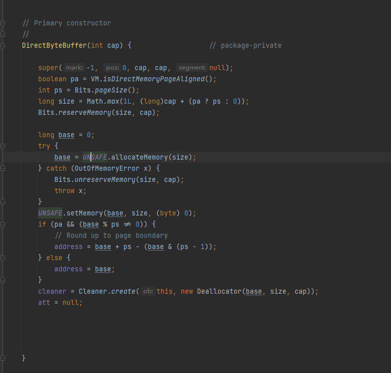
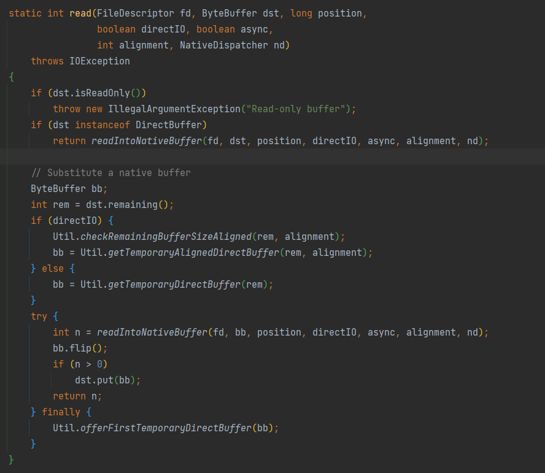

# FileChannel

只想看API怎么用的可以直接从目录跳转到Java代码

因为我电脑上面只有linux手册 查起来方便所以我下面都是基于linux讲的

### 名词解释

#### 堆内

```java
public static void main(String[] args) {
    Object o = new Object();
}
```

默认情况下这个对象将分配到堆上，假设它的地址是0x12345678。由于GC的问题，在某一次GC后它的地址就可能变为0x22345789，一般是那种带整理内存的GC会发生则这种情况，整理内存的目的在于避免内存碎片化，碎片化会导致虽然容量足够但是没有连续的内存用于分配对象。

综上得到，你不可以假定某一个对象固定在内存原地不动，这就是堆内内存的一个特性

有些地方会称之为java heap

#### 堆外

堆外内存就很好理解了 这是一块不受GC管理的内存，有些地方你可能看到一种描述——C Heap，就是指出由native分配的内存

**注意**：堆内内存和堆外内存这种分类法是用来描述java这种具有虚拟机语言的内存分类，像C这种native语言并没有这种说法，也和内核态空间，用户态空间不是一回事。堆内堆外内存均属于用户态内存。以上两种内存**都分配到当前进程的堆上**

简单来说 堆外内存来源于native方法中诸如 `malloc`这种方法分配出来的内存

#### 何使使用堆外内存？

1，需要进程间共享

2，需要很多内存用于储存数据，且生命周期比较长，会给GC很大压力，这种就可以尝试挂到堆外去

3，在某些场景下可以提升程序I/O操纵的性能。少去了将数据从堆内内存拷贝到堆外内存的步骤（或者反过来）。

#### native调用和内核态，用户态

内核态：cpu可以访问内存的所有数据，包括外围设备，例如硬盘，网卡，cpu也可以将自己从一个程序切换到另一个程序。

用户态：只能受限的访问内存，且不允许访问外围设备，占用cpu的能力被剥夺，cpu资源可以被其他程序获取。

系统调用：为了使上层应用能够访问到这些资源，内核为上层应用提供访问的接口

我们的代码跑在用户态是无法直接调用文件IO这些”特权“操作的，必须切换到内核态才行。而系统调用库就是帮我们调用切换到内核态的api（x86是使用一个陷阱机制 保存用户态上下文切换到内核态上下文实现的 并且切换了CPU的优先级机制 ），然后才可以实现我们的文件读写

### 传统的文件系统IO的原语

```CQL
//从文件中读取，存入tmp_buf
read(file_fd, tmp_buf, len);
//将tmp_buf写入文件
write(file_fd, tmp_buf, len);
```

我们先来看read方法 如果此时是使用的C语言来调用这个方法 那么数据和指令是怎么流动的？

1，read方法调用 刷新寄存器 保存当前状态 从用户态切换到内核态，从用户栈切换到内核栈，进行了一次**上下文切换**

2，内核态发起io请求 将当前线程/进程设置为阻塞态，交由DMA将数据拷贝到**内核空间的内存**中，CPU进行任务切换执行其他的任务

3，DMA拷贝完毕 向CPU发送中断（不知道中断是什么无所谓，就是告诉CPU IO数据准备完毕了），CPU打断当前执行的任务，处理中断。 此时类似于执行了一次回调 将进程/线程恢复就绪态，CPU此时将数据从**内核空间**拷贝到**用户空间**（即tem_buf的地址）

4，线程/进程获得到CPU时间片之后 从内核态切换到用户态，进行了一次**上下文切换**，接着执行

综上，我们进行了两次切换，一次CPU拷贝

那么在java中调用也是这样吗？

至少至今为止的操作都是这样的，但是此时拷贝到用户空间的`tmp_buf`可以直接被我们的程序使用吗？显然不行，因为他在堆外，要使用就得拷贝进来（变成byte[]），进而又追加了一次**拷贝** 这就是我们使用inputstream.read方法发生的事情。

那么为什么不直接让操作系统帮我们拷贝到堆内呢？

1，read原语传入的`tmp_buf`地址需要被”固定住“，是个逻辑上有效的

2，byte[]对象会收到GC的影响 他的实际内存地址会发生变动

3，JVM并没有规定byte[]的实现必须要是连续的

因此若指定堆内的某一个地址 IO完成时其地址可能不再”有效“，故不能直接拷贝到堆内


既然我们提到了GC的影响 为什么在堆外到堆内拷贝过程中我们却不考虑GC呢？

很简单，在调用native方法的时候实际上在safe point此时允许GC运行，这也是为什么native方法退出时要检测safe point的原因，而拷贝时没有safe point所以内存中的byte[]的地址是有效的

同理write原语 java heap -> c heap -> kneral

具体请参考[复制和固定 - IBM 文档](https://www.ibm.com/docs/zh/sdk-java-technology/7?topic=jnij-copying-pinning-1)

### directbuffer

如果我们能提供一个长时间有效的，不受GC管理的地址 就可以做到和C语言调用一样的效果了

这个就是`DirectBuffer`存在的意义，其就是通过Unsafe的native方法在 C heap上分配了一段堆外的内存

```java
ByteBuffer buffer = ByteBuffer.allocateDirect(int capacity);
```



### filechannel example

#### 读写

下面演示了一个最基础的通过channel读和追加

实际上就是读取全部然后再追加回去

若你需要一些特殊的flag比如说`O_DIRECT` 请看看ExtendedOpenOption 

```java
        File file = new File("temp.txt");
        ByteBuffer direct = ByteBuffer.allocateDirect((int) file.length());
        try( FileChannel read_channel = FileChannel.open(file.toPath(), StandardOpenOption.READ);
             FileChannel write_channel = FileChannel.open(file.toPath(), StandardOpenOption.APPEND,StandardOpenOption.WRITE)) 
        {
            read_channel.read(direct, 0);
            direct.flip();
            write_channel.write(direct);
        }
```

请注意 read和write方法接收的入参为ByteBuffer的子类，其有个heapByteBuffer的子类，若以这个子类入参的话 还是需要从java heap拷贝到c heap。若你需要从文件读取 再写入到文件 或者直接写入到socket中 最好还是使用directbuffer来减少拷贝

其最后都会转发到IOUtil的read方法上面 可以很清楚看到若不是directbuffer就会触发额外的拷贝



#### 文件传输

```java
File file = new File("temp.txt");
        File file1 = new File("t.txt");
        ByteBuffer direct = ByteBuffer.allocateDirect((int) file.length());
        try( FileChannel read_channel = FileChannel.open(file.toPath(), StandardOpenOption.READ);
             FileChannel write_channel = FileChannel.open(file1.toPath(), StandardOpenOption.APPEND,StandardOpenOption.WRITE))
        {
            long size = read_channel.size();
            read_channel.transferTo(0, size,write_channel);
        }
//public void transferTo(long position,long count,WritableByteChannel target);
```

请注意transferTo的第三个参数实际上是`WritableByteChannel` 其中`SocketChannel`也是这个类的子类

当我们需要在网络中传输一个文件时，为了避免CPU拷贝就可以使用这个方法（在之后的nio网络编程章节会进行补充）

其内部实现依赖于操作系统对zero copy技术的支持。在unix操作系统和各种linux的版本中，这种功能最终是通过sendfile()系统调用实现

在内核为2.4或者以上版本的linux系统上，socket缓冲区描述符将被用来满足这个需求。这个方式不仅减少了内核用户态间的切换，而且也省去了那次需要cpu参与的复制过程。 从用户角度来看依旧是调用transferTo()方法，但是其本质发生了变化：

1. 调用transferTo方法后数据被DMA从文件复制到了内核的一个缓冲区中。
2. 数据不再被复制到socket关联的缓冲区中了，仅仅是将一个描述符（包含了数据的位置和长度等信息）追加到socket关联的缓冲区中。DMA直接将内核中的缓冲区中的数据传输给协议引擎，消除了仅剩的一次需要cpu周期的数据复制。
3. 

#### 刷新到硬盘和page cache

```java
write_channel.force(true);
```

为什么要刷盘？

CPU如果要访问外部磁盘上的文件，需要首先将这些文件的内容拷贝到内存中，由于硬件的限制，从磁盘到内存的数据传输速度是很慢的，如果现在物理内存有空余，干嘛不用这些空闲内存来缓存一些磁盘的文件内容呢，这部分用作**缓存磁盘文件**的内存就叫做page cache。

用户进程启动read()系统调用后，内核会首先查看page cache里有没有用户要读取的文件内容，如果有（cache hit），那就直接读取，没有的话（cache miss）再启动I/O操作从磁盘上读取，然后放到page cache中，下次再访问这部分内容的时候，就又可以cache hit，不用忍受磁盘的龟速了（相比内存慢几个数量级）。

那么什么时候触发刷盘呢？

- **从空间的层面**，当系统中"dirty"的内存大于某个阈值时。该阈值以在[dirtyable memory](https://zhuanlan.zhihu.com/p/133173214)中的占比"dirty_background_ratio"（默认为**10%**），或者绝对的字节数"dirty_background_bytes"（2.6.29内核引入）给出。如果两者同时设置的话，那么以"bytes"为更高优先级。

此外，还有"dirty_ratio"（默认为**20%**）和"dirty_bytes"，它们的意思是当"dirty"的内存达到这个数量（屋里太脏），进程自己都看不过去了，宁愿停下手头的write操作（被阻塞，**同步**），先去把这些"dirty"的writeback了（把屋里打扫干净）。

而如果"dirty"的程度介于这个值和"background"的值之间（**10% - 20%**），就交给后面要介绍的专门负责writeback的background线程去做就好了（专职的清洁工，**异步**）。

- **从时间的层面**，即**周期性**的扫描（扫描间隔用"dirty_writeback_interval"表示，以毫秒为单位），发现存在最近一次更新时间超过某个阈值的pages（该阈值用"dirty_expire_interval"表示， 以毫秒为单位）。

若你的服务是需要保证数据不丢失，需要立刻刷入磁盘就需要自己手动刷一下 即force一下，以防止出现操作系统还没刷盘就崩溃的情况

**注意**：/proc/sys/vm文件夹查看或修改以上提到的几个参数

因为page cache的存在 所以连续访问的性能比随机访问好很多

#### O_DIRECT

这个flag太有意义 所以我单开一个写

这个flag实际上就是绕开page cache直接写磁盘，你可能会思考，绕开page cache不会导致性能很差吗？

实际上做数据库这种应用的时候用的很多，此时需要自己维护一套受控制的”page cache“机制

其还有几个缺点，比如说需要自己做内存对齐，虽然是直通硬盘但也不是确保完全刷盘（O_DIRECT只是绕过了page cache，但它并不等待数据真正写到了磁盘上。open()中flags参数使用**O_SYNC**才能保证writepage()会等到数据可靠的写入磁盘后再返回，适用于某些不容许数据丢失的关键应用）

这个实际上用的很少，以至于jdk10才加入这个flag功能

### 结论

java提供的filechannel实际上就是提供了一套对应到glibc IO原语的java api

由于Bytebuffer api过于难用 其实有更新的替代api

[OpenJDK: Panama (java.net)](http://openjdk.java.net/projects/panama/)

在本文完成时（2022年4月22日），这个project已经进入孵化器状态，已经合并进主线，下一个lts将正式进入系统库

本文仍有很多不足之处，毕竟unix编程花了半本书来讲述这些系统调用的实现和使用，以及坑。请读者自行进行扩展学习操作系统等相关知识。

**若有时间请一定要用C试试这些IO原语 加强理解**