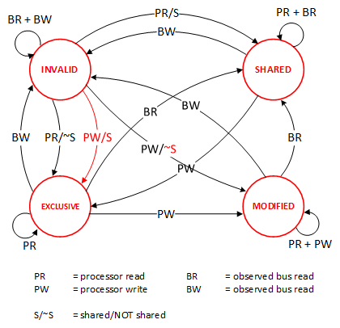
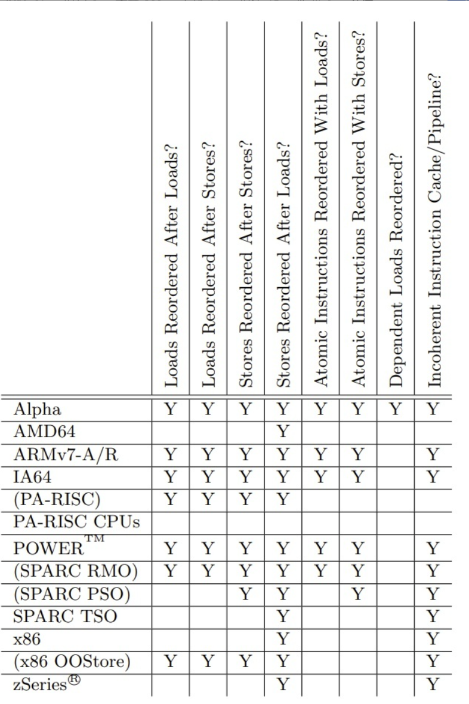

# volatile，JMM和jdk9内存顺序

### 太长不看TL;DR：

volatile是个非常复杂的关键字，如果你只是好奇如何使用那么只需要读这一节，剩下的部分选读

由于多核处理器的架构问题，一个被多个线程共享的变量在被某一个线程修改后，其他线程并不能**立刻**看到这个修改操作，因此需要这个关键字修饰让它可以直接让其他线程立刻**看到**这个变量的修改

直觉上，它说明一个变量是“易变的”，这意味着读写该变量的时候，缓存上的数据都不可靠，得从内存中读写

给人的感觉就是直接从主存中读取的，即大家都是读取的同一块内存

好了 本文到此结束 您可以离开了

### CPU看到的变量和指令

> 这一部分内容由于不同CPU的架构不同，并不具有通用性
>
> 这里都是一些概念
>
> 我查到的资料也不一定是正确的，具有时效性的，所以敬请自己甄别
>
> **请大家不要完全相信这里的所有观点，如果有任何异议欢迎带着具体的实例反驳并留言**

#### 变量

当前 CPU 性能强劲，程序的主要的瓶颈不在计算，而在数据读写。根据 [Latency Numbers Every Programmer Should Know](https://colin-scott.github.io/personal_website/research/interactive_latency.html) 里的数据，2020 年，访问 L1 缓存需要 1ns，而访问内存/主存则需要 100ns。因此不管是硬件还是软件的优化，都在尝试提升缓存的命中率。（一个很有名的例子就是正序遍历数组比倒序快，这就是利用了内存局部性原理）

而破坏原子性、可见性、有序性，很大程度上也是为了充分利用缓存。

举个例子：


核内独占 L1, L2 缓存，核间共享 L3 缓存。其中 L1 分为指令高速缓存(i-cache)和数据高速缓存(d-cache)。

在 CPU 指令需要读取内存时，会先尝试从 L1 缓存中读取，如果发现缓存中没有(称作 cache miss)，则开始从 L2 中读取，依此类推，最终会从内存中读取数据。我们上面说过，缓存的访问速度与内存的访问速度天差地别，因此很多时候，无论是编译器还是 CPU 都会尽量让运行的代码能充分利用缓存。

思考一个情况：变量a被读取到L1中，core0修改a = 2后 自己能看到此时a是2，但是此时这个修改结果并没有同步到其他核，那么他们看到的就不可能是2，也就是说a的可见性没有保证。

#### MESI 缓存一致性

> 这种只是一种很理想的状态

并发场景下（比如多线程）如果操作相同变量，如何保证每个核中缓存的变量是正确的值，这涉及到一些”缓存一致性“的协议。其中应用最广的就是MESI协议（当然这并不是唯一的缓存一致性协议）。

**注意：下面的内容并不指定处理器架构，而是从一个比较学术派的角度来说**

下面两个表格其实不看也行

| 状态           | 描述                                                         |
| -------------- | ------------------------------------------------------------ |
| M（Modified）  | 代表该缓存行中的内容被修改了，并且该缓存行只被缓存在该CPU中。这个状态的缓存行中的数据和内存中的不一样，在未来的某个时刻它会被写入到内存中（当其他CPU要读取该缓存行的内容时。或者其他CPU要修改该缓存对应的内存中的内容时 |
| E（Exclusive） | 代表该缓存行对应内存中的内容只被该CPU缓存，其他CPU没有缓存该缓存对应内存行中的内容。这个状态的缓存行中的内容和内存中的内容一致。该缓存可以在任何其他CPU读取该缓存对应内存中的内容时变成S状态。或者本地处理器写该缓存就会变成M状态 |
| S（Shared）    | 该状态意味着数据不止存在本地CPU缓存中，还存在别的CPU的缓存中。这个状态的数据和内存中的数据是一致的。当其他CPU修改该缓存行对应的内存的内容时会使该缓存行变成 I 状态 |
| I（Invalid）   | 代表该缓存行中的内容是无效的                                 |

那么不同的核是怎么知道发生了变化的呢？自然是有个消息机制（总线嗅探）

| 消息类型               | 请求/响应 | 描述                                                         |
| ---------------------- | --------- | ------------------------------------------------------------ |
| Read                   | 请求      | 通知其他处理器和内存，当前处理器准备读取某个数据。该消息内包含待读取数据的内存地址 |
| Read Response          | 响应      | 该消息内包含了被请求读取的数据。该消息可能是主内存返回的，也可能是其他高速缓存嗅探到Read 消息返回的 |
| Invalidate             | 请求      | 通知其他处理器删除指定内存地址的数据副本（缓存行中的数据）。所谓“删除”，其实就是更新下缓存行对应的FLAG（MESI那个） |
| Invalidate Acknowledge | 响应      | 接收到Invalidate消息的处理器必须回复此消息，表示已经删除了其高速缓存内对应的数据副本 |
| Read Invalidate        | 请求      | 此消息为Read 和 Invalidate消息组成的复合消息，主要是用于通知其他处理器当前处理器准备更新一个数据了，并请求其他处理器删除其高速缓存内对应的数据副本。接收到该消息的处理器必须回复Read Response 和 Invalidate Acknowledge消息 |
| Writeback              | 响应      | 消息包含了需要写入内存的数据和其对应的内存地址               |



你可以看看这个网站做做测试[VivioJS MESI help (tcd.ie)](https://www.scss.tcd.ie/Jeremy.Jones/vivio/caches/MESIHelp.htm)

#### Store Buffer

如果一个核发出一个消息说自己的某个缓存被修改了，此时要是这个核还在等待别的核发送确认那么就会降低了CPU工作效率，毕竟CPU的各项设计都是尽可能并行，尽可能异步，希望由外界通知而不是主动等待。所以有些CPU引入了Store Buffer（写缓存器）技术，也就是在CPU和cache之间又加了一层buffer，在CPU执行写操作时直接写StoreBuffer，然后就忙其他事去了，等其他CPU都置为I之后，CPU1才把buffer中的数据写入到缓存行中。

#### Invalidate Queue

那么其他CPU接到消息后也是写入到缓存中才发消息吗？显然为了加快整个流程它不会这么做，他们会写入一个Invalidate Queue（无效化队列），还没把缓存置为I状态就发送响应了。后续CPU会异步扫描Invalidate Queue，将缓存置为I状态。和Store Buffer不同的是，在CPU1后续读变量x的时候，会先查Store Buffer，再查缓存。而CPU0要读变量x时，则不会扫描Invalidate Queue，所以存在脏读可能。
还记得最开始的话吗？**本文并不指定处理器架构** ，比如说其实x86没有Invalidate Queue

#### 指令

记得之前的文章吗？我很多地方都强调了，假设当前的代码实际执行和书写顺序一致，而实际上并不是这样。我们的编译器（java的c1,c2），CPU都会根据因果一致性的前提进行指令的重排

这里插入一下 什么是因果一致性？

```java
1 a=1;
2 b=1;
3 c = a+1;
```

对于1，2这两者并没有依赖关系 即编译器和CPU可以任意重排顺序执行（或者你可能看见过这样一个词 **as-if-serial**）。而1 3有依赖关系，所以这两句不能重排列，即这个指令的顺序可能是 1 2 3或者2 1 3。这种情况下单线程是看不出差距的，但是多线程情况下，就可能导致另外一个线程看到b=1但是a!=1的情况了。

**注意：下面的内容并不指定处理器架构，而是从一个比较学术派的角度来说**

cpu为了提高流水线的运行效率，会做出比如：

1)对无依赖的前后指令做适当的乱序和调度；

2)对控制依赖的指令做分支预测；

3)对读取内存等的耗时操作，做提前预读；

等等。以上总总，都会导致指令乱序的可能。

因为乱序导致出问题其实是普遍的 举个例子glibc2.13的qsort在并发时有概率会coredump

[11655 – qsort() not thread safe, results to division by zero (sourceware.org)](https://sourceware.org/bugzilla/show_bug.cgi?id=11655)

#### 总结

以上不过是些名词解释，用于方便理解各种边界条件，你会发现不同的CPU架构都需要不同的解决方案，这就是JMM的意义所在，屏蔽差异。

### 屏障

什么是屏障？就是用来阻挠某些东西出来的设施，我们可以用来防止编译器或者CPU对指令进行重排

对于编译器屏障 就是告诉编译器以这一行为界，不要让两边代码乱序，比如说上面的代码不许乱序到下面，下面代码不许排序到上面

比如说你可以在你的源码中内嵌__asm ("" ::: "memory")，gcc就会意识到你插入了一个编译器屏障

对于内存屏障，就是确保两个操作的前后顺序不乱序，在谈及CPU时，通常会把变量的读操作称为load，变量的写操作称为store。两两组合因而会出现4类读写操作：

- LoadLoad屏障：保证前面的Load在后面的Load之前完成
- StoreStore屏障：保证前面的Store在后面的Store之前完成
- LoadStore屏障：保证前面的Load在后面的Store之前完成
- StoreLoad屏障：保证前面的Store在后面的Load之前完成。

**注意：由于不同CPU架构不同，并不是所有的CPU都需要这几种屏障，比如说x86一致性比较好，所以只需要storeload屏障，其他三个操作都能保证不乱序**

CPU的内存屏障如果只是保证指令顺序不会乱，也未必会让程序执行符合预期。因为MESI为了提升性能，引入了**Store Buffer**和**Invalidate Queue。所以内存屏障还有其他功能：**

**写类型的内存屏障**还能触发内存的强制更新，让Store Buffer中的数据立刻回写到内存中。**读类型的内存屏障**会让Invalidate Queue中的缓存行在后面的load之前全部标记为失效。

用一张图来说明各个架构的乱序问题



### java9带来的内存顺序api

首先是一堆新名词

Plain 就是普通的访问

Opaque 插入编译器屏障的访问 但是没有涉及任何的内存屏屏障

#### Coherence 

 即对单个内存位置的写看上去是按照与程序顺序一致的总顺序进行的。看上去有点难以理解，结合下面的例子，可以这样理解：在全局，x 由 0 变成了 1，那么每个线程中看到的 x 只能从 0 变成 1，而不会可能看到从 1 变成 0.

例子1：

```c
x             |   int r1 = x;
x=1;          |   int r2 = x;
```

那么在 Java 内存模型下，可能的结果是包括：

1. `r1 = 1, r2 = 1`
2. `r1 = 0, r2 = 1`
3. `r1 = 1, r2 = 0`
4. `r1 = 0, r2 = 0`

其中第三个结果很有意思，从程序上理解即我们先看到了 x = 1，之后又看到了 x 变成了 0.当然，通过前面的分析，我们知道实际上是因为**编译器乱序**。如果我们不想看到这个第三种结果，我们所需要的特性即 coherence。

#### Causality（因果性）与 Acquire/Release

首先看个例子

一个线程给x，y赋值 ，注意下这里我们不考虑x,y在同一个缓存行的情况，即一个缓存失效不会导致另外一个缓存失效

另一个线程执行(r1, r2 为本地变量)：

```c
x=1;                    |   int r1 = y;
y=1;                    |   int r2 = x;
```

若是plain情况则是有这些情况：

1. `r1 = 1, r2 = 1`
2. `r1 = 0, r2 = 1`
3. `r1 = 1, r2 = 0`
4. `r1 = 0, r2 = 0`

第三个结果也是很有趣的，第二个线程先看到 y 更新，但是没有看到 x 的更新，还记得之前说的，内存屏障还能保证刷新缓存的功能吗？我们需要像这样加内存屏障才能避免第三种情况的出现，即：

```c
x=1;                    |   int r1 = y;
write_barrier();        |    read_barrier();
y=1;                    |   int r2 = x;
```

线程 1 执行 x = 1 之后，在 y = 1 之前执行了写屏障，保证 store buffer 的更新都更新到了缓存，y = 1 之前的更新都保证了不会因为存在 store buffer 中导致不可见。线程 2 执行 int r1 = y 之后执行了读屏障，保证 invalidate queue 中的需要失效的数据全部被失效，保证当前缓存中不会有脏数据。这样，如果线程 2 看到了 y 的更新，就一定能看到 x 的更新。

我们把写屏障以及后面的一个 Store（即 y = 1）理解为将前面的更新（x=1）打包，然后将这个包在这点发射出去，读屏障与前面一个 Load（即 int r1 = y）理解成一个接收点，如果接收到发出的包，就在这里将包打开并读取进来

在发射点，会将发射点之前（包括发射点本身的信息）的所有结果打包，如果**在执行接收点的代码的时候接收到了这个包，那么在这个接收点之后的所有指令就能看到包里面的所有内容，即发射点之前以及发射点的内容**。Causality（因果性），有的地方也叫做 Casual Consistency（因果一致性），它在不同的语境下有不同的含义，我们这里仅特指：可以定义一系列写入操作，如果读取看到了最后一个写入，那么这个读取之后的所有读取操作，都能看到这个写入以及之前的所有写入操作。

听起来是不是特别复杂？好了 我们先抛开这些教科书词汇，我们先来看个例子：

release/acquire 的API

```java
class A{
    static final VarHandler X;
    static final VarHandler Y;
    static {
        X = MethodHandles.lookup().findVarHandler(A.class,"x",int.class);
        Y = MethodHandles.lookup().findVarHandler(A.class,"y",int.class);
    }
    int x,y;
    public void thread0(){
        x = 1;
        Y.setRelease(this,1); //打包点
    }
    public void thread1(){
        int r1 = (int) Y.getAccquire(this); //解包点
        r2 = x;
    }
}
```

根据我们的打包 解包理论+因果关系，我们可以很容易推断得到

若r1==1则r2 == 1，即r1 = 1, r2 = 0这种不可能出现了

那么再用我们之前的四种屏障来描述它是怎么实现的

我们可以通过前面我们的抽象推出来，首先是发射点。发射点首先是一个 Store，并且保证打包前面的所有，那么不论是 Load 还是 Store 都要打包，都不能跑到后面去，所以**需要在 Release 的前面加上 LoadStore，StoreStore 两种内存屏障来实现**。

同理，接收点是一个 Load，并且保证后面的都能看到包里面的值，那么无论 Load 还是 Store 都不能跑到前面去，所以**需要在 Acquire 的后面加上 LoadLoad，LoadStore 两种内存屏障来实现**。

### Volatile 

笑死 终于到Volatile了,简单的单变量的可见性不再赘述

我们直接看看两个变量情况的内存变化的爱恨情仇

Volatile 其实就是在 Release/Acquire 的基础上，进一步保证了 Consensus；Consensus 即所有线程看到的内存更新顺序是一致的，即所有线程看到的内存顺序全局一致

举个例子

```java
x,y
x=1;                    |   int y = 1;
int r1 = y              |   int r2 = x;
```

在plain模式访问，同样可能有4种结果：

1. `r1 = 1, r2 = 1`
2. `r1 = 0, r2 = 1`
3. `r1 = 1, r2 = 0`
4. `r1 = 0, r2 = 0`

第四个结果是不符合 Consensus 的，因为两个线程看到的更新顺序不一样（第一个线程看到 0 代表他认为 x 的更新是在 y 的更新之前执行的，第二个线程看到 0 代表他认为 y 的更新是在 x 的更新之前执行的）。如果没有乱序，那么肯定不会看到 x, y 都是 0，因为线程 1 和线程 2 都是先更新后读取的

如果要保证 Consensus，我们只要保证线程 1 的代码与线程 2 的代码不乱序即可，即在原本的内存屏障的基础上，添加 StoreLoad 内存屏障.

```c
x,y
LoadStore               |   LoadStore
StoreStore              |   StoreStore
x=1;                    |   int y = 1;
StoreLoad               |   StoreLoad  
int r1 = y              |   int r2 = x;
LoadLoad                |   LoadLoad
LoadStore               |   Loadtore
```

### Final

为什么要讲这个，这个和内存顺序关系大吗？我们先不考虑这个问题，先来看一段c语言初始化结构体代码

```c
struct P{
    int a;int b;
}
void s(){
    struct P* obj = (P*)malloc(sizeof(P)); 
    obj.a = 1;obj.b;
}
```

实际上我们的java实例化也是这样的

```java
P p = new P(1,1);
________________________________________________
P* tmp = new P();
2 tmp.a = 1;tmp.b =2;
3 p = temp;
```

根据之前的说明，其实这几行代码（2和3），是可以乱序的，即你在其他线程观测到的这个p时 a,b不一定初始化完毕了

**注意：大部分读者电脑都是x86 storestore是不会乱序的，所以你观测不到这个情况**，根据上面的表，你可以在aarch64上面复现出这个情况

那么怎么改呢？直接在2之后加storestore就行了，或者3使用setRelease也可以

那么和final有什么关系呢？还记得我们之前讲的线程安全部分中提到的不可变类吗？

如果一个类不具有可修改性，那么可以安全地在多个线程间共享。

为了做到不可变那么final是不可缺少的，但是如果我们对于初始化阶段final变量的读写都没有做任何屏障的话会发生什么？

不同的线程可能看到了虽然初始化分配了一块内存 构造函数也执行完毕了，但是**final变量没有初始化**，因为发生了重排。所以jvm需要增强final的语义以确保final在构造结束后必须被赋值完毕。

这就是为什么jvm为final加入了storestore屏障的原因

#### Spring Bean 初始化如何保证线程安全

看了final这个情况，你可能会想 我们写spring代码的时候经常使用字段注入，既没有final也没有volatie，那我们并发获取到一个bean的时候会存在对应的字段没有正确初始化的问题吗？

1. Spring 的 Bean 会存储在一个 map 中（`DefaultSingletonBeanRegistry::singletonObjects`）
2. 每次存储或获取某个 Bean，都会显示在这个 map 上加内置锁（synchronized）
3. 由于 JMM 的“监视器锁规则”，lock 能看到同一个监视器的 unlock 前的变化

于是，我们只要注入了某个 Bean，那么这个 Bean 的初始化的内容就是可见的，上例中，在 `MyService` 中看到了 `myData` 这个 Bean，就可以保证 `myData` 已经被正确初始化了。并且这里的初始化不仅仅指构造函数中的内容，而是 Spring 语境下的初始化，还包括setter 注入，PostConstruct 初始化等。

但是要注意，这个机制要求 Bean 的初始化和获取都是通过 Spring 完成的。如果 Bean 初始化后又做了修改，或者 Bean 不是通过 ApplicationContext 或 Autowired 获取的，则没有这个可见性保证。

[java - Should I mark object attributes as volatile if I init them in @PostConstruct in Spring Framework? - Stack Overflow](https://stackoverflow.com/questions/23906808/should-i-mark-object-attributes-as-volatile-if-i-init-them-in-postconstruct-in/23992532#23992532)

